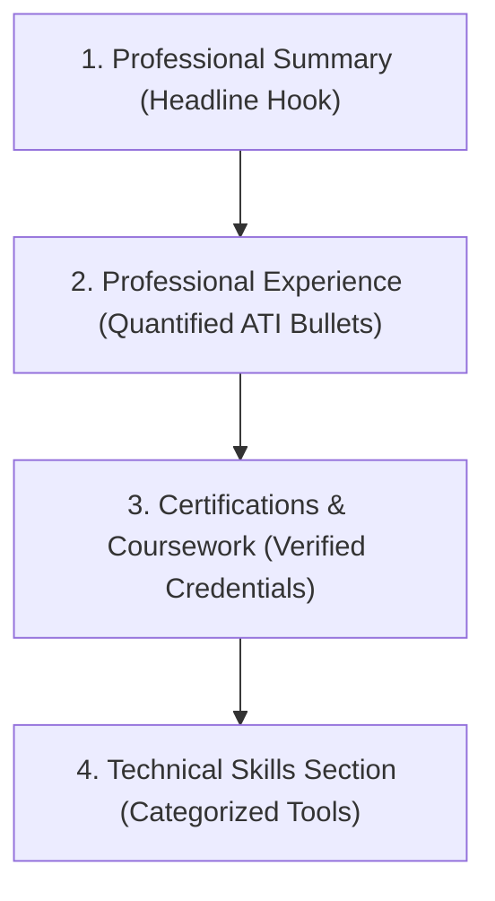

## **The New Resume Standard: From Taboo to Competitive Advantage**

Just two years ago, job seekers debated whether mentioning artificial intelligence on a resume was risky. Candidates worried that recruiters might assume they were taking shortcuts or lacked foundational skills.

In 2026, and heading decisively into 2027, the sentiment has completely flipped. According to LinkedIn's Global Talent Trends, **job postings referencing AI skills have surged by over 350%**, and 78% of enterprise hiring managers report that they would rather hire an employee with AI proficiency than a more experienced candidate without it.

However, there is a right way and a disastrously wrong way to showcase AI on your resume.

Listing "ChatGPT" as an isolated bullet point alongside "Microsoft Word" signals to recruiters that you are a casual novice. Conversely, articulating how you use **structured context architecture, multi-modal synthesis, and automated agent workflows** to drive revenue or cut costs positions you as an indispensable, future-ready leader.

---

## **The 3 Cardinal Sins of Listing AI on Your Resume**

```text
❌ Sins to Avoid:
├── Sin 1: The Standalone Buzzword ("Skills: ChatGPT, AI, Prompt Engineering")
│   └── Looks like keyword stuffing; proves zero practical competency.
│
├── Sin 2: Claiming False Technical Depth ("Expert in Neural Network Architecture")
│   └── If you only use prompt interfaces, don't claim to build backpropagation models.
│
└── Sin 3: Submitting an Unedited AI-Generated Resume
    └── Submitting generic, cliché-heavy cover letters that scream "zero human effort".
```

---

## **The Winning Formula: Action + Tool + Measurable Impact**

Every mention of AI in your professional experience section should follow the **Action-Tool-Impact (ATI) Formula**:

$$\text{Strong Action Verb} + \text{Specific AI Workflow/Tool} + \text{Quantifiable Business Outcome}$$

---

### **Role-Specific Before-and-After Transformations**

#### **1. Marketing & Content Strategy**
* **Before (Weak)**: *"Used AI tools to write marketing content for our blog."*
* **After (ATI Formula)**: *"Architected a multi-stage editorial pipeline using Claude and Perplexity to produce 24 SEO-optimized whitepapers, increasing organic search impressions by 140% while cutting external agency spend by $35,000."*

#### **2. Software Engineering & Web Development**
* **Before (Weak)**: *"Used GitHub Copilot to code faster."*
* **After (ATI Formula)**: *"Integrated GitHub Copilot and automated linting agents into team CI/CD workflows, accelerating weekly sprint feature velocity by 25% while maintaining zero regression bugs across 12 consecutive releases."*

#### **3. Human Resources & Corporate L&D**
* **Before (Weak)**: *"Used ChatGPT for employee onboarding materials."*
* **After (ATI Formula)**: *"Deployed custom GPT tutoring bots and Synthesia video avatars to modularize new hire compliance training, reducing employee time-to-productivity from 28 days to 11 days across 450 global remote hires."*

#### **4. Finance & Data Analytics**
* **Before (Weak)**: *"Familiar with AI data analysis."*
* **After (ATI Formula)**: *"Engineered automated Python data-cleaning scripts and LLM synthesis prompts to analyze 10,000+ customer churn records, identifying 4 critical attrition drivers and saving $1.2M in annual recurring revenue."*

---

## **Where to Place AI on Your Resume Layout**



### **1. In Your Professional Summary (The Top 1/3)**
Hook the recruiter immediately with high-level positioning:
* *"Senior Instructional Designer with 8+ years of enterprise experience building scalable e-learning curricula. Pioneer in integrating ethical generative AI workflows to cut course authoring cycles in half without sacrificing pedagogical rigor."*

### **2. In a Dedicated "Technical & AI Tools" Skills Section**
Group your technical proficiencies logically so Applicant Tracking Systems (ATS) can parse them cleanly:
* **AI & Workflow Automation**: Claude 3.5 Sonnet, ChatGPT-4o, Make, n8n, Prompt Architecture, RAG Evaluation.
* **Instructional Authoring**: Articulate Storyline 360, Rise, LearnWorlds, Camtasia.
* **Analytics & Standards**: SCORM 2004, xAPI (Tin Can), Google Analytics 4, SQL.

### **3. In Your Education & Certifications Section**
List specific coursework, issuing institutions, and completion dates:
* **Generative AI for Leaders Specialization** — Vanderbilt University (Coursera), 2026
* **Certified AI Prompt Engineer** — DeepLearning.AI, 2026
* **AWS Certified Cloud Practitioner** — Amazon Web Services, 2025

---

## **Conclusion: Prove That You Steer the Tool**

At the end of the day, hiring managers are not looking to hire software; they are looking to hire **resourceful, forward-thinking professionals who know how to wield modern software to solve hard business problems**.

By demonstrating thoughtful prompt engineering, rigorous output verification, and measurable ROI across your resume, you signal to recruiters that you are not just keeping pace with technological change—you are actively driving it.
