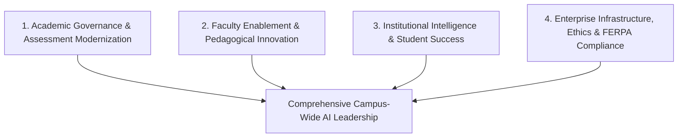

## **The Strategic Crossroads for Academic Leadership**

Higher education faces a generational inflection point. Over the past three decades, university administrations weathered the transitions to personal computing, campus-wide Wi-Fi, and online learning management systems.

However, the advent of generative Artificial Intelligence represents a fundamentally different challenge. AI does not merely change the medium of delivery; it directly interrogates the core products of the academy: **knowledge production, intellectual rigor, credentialing integrity, and student employability**.

For university presidents, provosts, and academic deans, adopting a reactive, piecemeal posture—leaving AI guidelines to individual professors' syllabus footnotes—exposes the institution to brand erosion, faculty burnout, and declining enrollment. Modern higher education leaders must transition from crisis management to visionary, proactive institutional transformation.

---

## **The 4 Pillars of Institutional Higher Ed AI Adoption**

---

### **Pillar 1: Academic Governance & Assessment Modernization**
The initial academic reaction to AI—attempting to catch cheaters using flawed detector algorithms—has proved to be a strategic dead end. Leadership must guide faculty toward fundamental assessment reform:
* **Outcome-Based Curriculum Restructuring**: Shift away from memorization metrics toward high-order synthesis, interdisciplinary problem-solving, and applied client projects.
* **Discipline-Specific Nuance**: Recognize that an engineering school, an English department, and a nursing program require fundamentally different AI guidelines. Central governance should establish broad ethical guardrails while empowering department chairs to define pedagogical boundaries.

---

### **Pillar 2: Faculty Enablement & Incentives**
You cannot mandate innovation from an exhausted, under-supported faculty cohort. If professors view AI adoption as an unfunded administrative mandate, resistance will dominate campus senate meetings.
* **Dedicated Centers for Teaching and Learning (CTL) Stipends**: Provide competitive course-release grants or summer stipends for faculty members who redesign core introductory courses to integrate AI literacy.
* **Tenure and Promotion Recognition**: Update tenure review portfolios to explicitly reward pedagogical research and digital innovation alongside traditional peer-reviewed journal publishing.

---

### **Pillar 3: Institutional Intelligence & Predictive Student Success**
Beyond the classroom, higher education leaders oversee complex multi-million-dollar enterprises facing demographic enrollment cliffs. AI tools yield profound operational efficiencies:
* **Early-Warning Retention Analytics**: Machine learning models that synthesize LMS participation, library resource access, and midterm quiz momentum identify students at risk of course withdrawal weeks before drop deadlines.
* **24/7 Socratic Academic Advising & Financial Aid Bots**: Custom conversational agents answer basic registration, financial aid, and prerequisite transfer questions instantly, freeing human academic advisors to conduct high-empathy, complex counseling.

---

### **Pillar 4: Enterprise Infrastructure, Ethics & Data Sovereignty**
Allowing students and researchers to independently feed campus data into public commercial LLMs presents severe legal, regulatory, and intellectual property hazards:
* **FERPA & HIPAA Compliance**: Any campus-wide AI tool must guarantee that student academic records and university healthcare data are legally ring-fenced and never stored in third-party public training corpora.
* **Campus-Wide Enterprise Licensing**: Partnering with enterprise vendors to provide every student and faculty member with a secure, institutional sandbox ensures digital equity, eliminating disparities between affluent students who can afford premium AI subscriptions and those who cannot.

---

## **The 18-Month Leadership Execution Timeline**

| Milestone Phase | Primary Focus Area | Core Deliverables |
| :--- | :--- | :--- |
| **Months 1 - 3** | Discovery & Taskforce Formation | Cross-functional AI taskforce (Provost, CIO, General Counsel, Faculty Senate, Student Gov). |
| **Months 4 - 6** | Policy Synthesis & Town Halls | Campus-wide AI principles statement; student data privacy audit; faculty listening forums. |
| **Months 7 - 12** | Pilot Deployments & CTL Bootcamps | Enterprise AI sandbox rollout; summer faculty redesign grants for high-enrollment courses. |
| **Months 13 - 18** | Institutional Scaling & Assessment | Longitudinal retention review; employer alignment council review; curriculum accreditation updates. |

---

## **Conclusion: Safeguarding the Future of the Academy**

Universities that attempt to wall themselves off from technological reality will face mounting skepticism from prospective students and enterprise employers. Conversely, institutions that lead with intellectual courage—embedding ethical AI fluency into general education while doubling down on human mentorship, collaborative discourse, and ethical leadership—will define the gold standard of 21st-century higher education.
