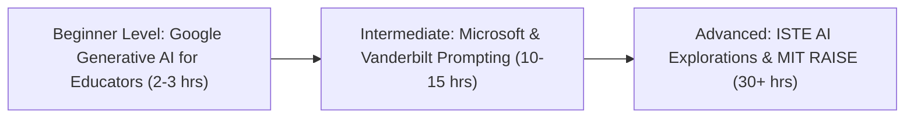

## **The Growing Imperative for Educator AI Literacy**

Over the past three years, artificial intelligence has fundamentally disrupted primary, secondary, and post-secondary education. While schools initially scrambled with reactionary bans and detection software, school boards and superintendents have recognized that **teacher professional development is the single most critical factor in successful AI adoption**.

Teachers who earn formal, accredited **AI certifications** gain more than just a credential for their resume; they acquire the pedagogical confidence, ethical discernment, and practical frameworks required to guide students safely through an AI-saturated world.

Whether you are a classroom teacher seeking to streamline administrative burdens, an instructional coach guiding district curriculum, or an educator looking to earn Continuing Education Units (CEUs) for salary step advancement, here are the top accredited AI certifications available in 2026.

---

## **The Top 5 AI Certifications for Educators Compared (2026)**

---

### **1. Google for Education: Generative AI for Educators**
Developed in collaboration with MIT RAISE, this popular self-paced course is designed specifically for working teachers with zero technical background.
* **Curriculum Focus**: Drafting differentiated lesson plans, generating personalized reading passages, formulating multi-step rubrics, and saving up to 5 hours weekly on administrative tasks.
* **Duration**: 2 to 3 hours (Self-paced).
* **Cost**: Free (or low-cost verified certificate option).
* **Best For**: Busy teachers seeking immediate, practical classroom time-savers.

---

### **2. ISTE Artificial Intelligence Explorations for Educators**
The International Society for Technology in Education (ISTE) provides what is widely acknowledged as the nation's most rigorous and prestigious credential for educational technology leaders.
* **Curriculum Focus**: Deep pedagogical integration across STEM, humanities, and arts; addressing algorithmic bias; student privacy governance; and designing project-based learning units where students build with AI.
* **Duration**: 30 hours over 8 to 10 weeks (Facilitated cohort).
* **Cost**: $300 to $450 (Discounts for ISTE members; often district-reimbursed).
* **Best For**: Instructional technology coaches, department chairs, and curriculum directors.

---

### **3. Vanderbilt University: Prompt Engineering for ChatGPT in Education (Coursera)**
Taught by Dr. Jules White, this university-level specialization focuses on the intellectual mechanics of prompt architecture and cognitive scaffolding.
* **Curriculum Focus**: Advanced prompt patterns, Socratic tutoring design, automated assessment workflows, and constructing customized GPT tutors for specific classroom textbooks.
* **Duration**: Approximately 15 to 18 hours.
* **Cost**: Included with Coursera Plus ($59/month or $399/year) or available via financial aid.
* **Best For**: High school and college educators wanting deep, versatile prompt mastery.

---

### **4. Microsoft Certified Educator (MCE) & AI Classroom Toolkit**
Microsoft's educator ecosystem integrates directly with Microsoft 365, Copilot, Teams for Education, and Minecraft Education.
* **Curriculum Focus**: Utilizing Copilot to scaffold inclusive learning environments, generating real-time reading progress analytics, and fostering digital citizenship.
* **Duration**: 6 to 10 hours.
* **Cost**: Free training modules; optional proctored exam fee for official MCE certification.
* **Best For**: Educators in Microsoft-centric school districts.

---

### **5. MIT Media Lab: RAISE (Responsible AI for Social Empowerment and Education)**
MIT's outreach initiative focuses on empowering educators and students from historically underrepresented backgrounds.
* **Curriculum Focus**: Demystifying machine learning, teaching ethical algorithmic governance, and hands-on creative coding with AI tools.
* **Duration**: Varies by module.
* **Cost**: 100% Free Open Educational Resources (OER).
* **Best For**: Middle and high school STEM, computer science, and civics educators.

---

## **Comparative Overview: Choosing the Right Program**

| Program | Issuer | Duration | Cost | Best Use Case |
| :--- | :--- | :---: | :---: | :--- |
| **Generative AI for Educators** | Google for Education | 2 - 3 Hours | Free | Instant daily administrative time-savers |
| **ISTE AI Explorations** | ISTE Non-Profit | 30 Hours | $300 - $450 | Formal district leadership & state CEU hours |
| **Prompting in Education** | Vanderbilt Univ. (Coursera) | 15 Hours | $59 / mo | Socratic tutoring & advanced prompt patterns |
| **Microsoft AI Classroom** | Microsoft | 8 Hours | Free | Teams / Copilot 365 district integrations |
| **MIT RAISE Curriculum** | MIT Media Lab | Modular | Free | K-12 ethical AI literacy & social impact |

---

## **How AI Certification Accelerates Your Career**

Beyond the immediate satisfaction of mastering cutting-edge classroom tools, earning a verified AI credential unlocks tangible professional benefits:

1. **Salary Step Progression**: Many public school collective bargaining agreements grant salary step increases when teachers accumulate verified graduate credits or approved CEU hours.
2. **Transition to Instructional Coaching**: Certified teachers are frequently appointed as designated campus AI leads, providing peer mentorship and delivering school district professional development workshops.
3. **Leadership in EdTech Consulting**: Educators holding certified AI credentials are in high demand as corporate curriculum consultants and advisors for EdTech software startups.

---

## **Conclusion: Guiding the Next Generation**

Artificial intelligence will never replace the profound human empathy, moral encouragement, and inspiration that a dedicated teacher provides. But educators who master AI will inevitably replace those who refuse to adapt.

By completing an accredited AI certification, you equip yourself with the tools to inspire your students, elevate your teaching craft, and lead your school community into the future of education.
