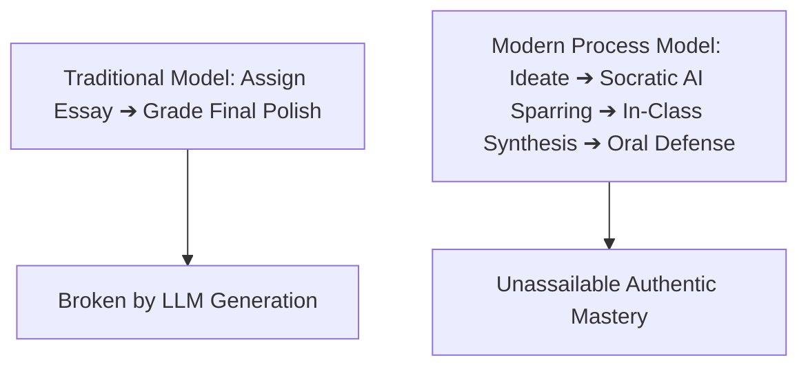

## **The Great Reversal: From Prohibition to Pedagogical Literacy**

In early 2023, when generative artificial intelligence first entered the mainstream, the New York City Department of Education—the largest public school district in the United States, serving over one million students—made international headlines by blocking ChatGPT across all school devices and networks. The rationale was understandable: school administrators feared an imminent collapse of academic integrity, homework plagiarism, and the erosion of foundational writing skills.

However, within months, educational reality asserted itself. Students with home internet and cellular smartphones continued to utilize AI outside school walls, creating a glaring digital equity divide. Furthermore, industry employers made it abundantly clear that AI fluency would be a non-negotiable prerequisite for 21st-century careers.

By mid-2023, NYC Schools Chancellor David Banks publicly reversed the ban, stating: *"The knee-jerk reaction was that everyone is going to cheat. But the truth is, AI is here to stay, and our students must learn to navigate it thoughtfully."*

In 2026, New York has transitioned from a battleground over AI prohibition into one of the nation's most progressive incubators for **AI-augmented pedagogy**.

---

## **The Failure of Automated AI Detection Software**

One of the most consequential lessons learned by New York educators over the past three years is that **AI plagiarism detectors do not work**.

Independent studies conducted across Columbia University, NYU, and national testing consortia revealed critical flaws in automated detection algorithms:

1. **Unacceptable False-Positive Rates**: Detectors regularly flagged authentic human essays as AI-authored, damaging trust between teachers and high-performing students.
2. **Discriminatory Bias Against Non-Native English Writers**: In an urban district where over 150 languages are spoken and 15% of students are English Language Learners (ELLs), algorithms disproportionately flagged simple, repetitive, but authentic student prose as "machine-generated."
3. **Effortless Workarounds**: Minor student edits, synonym replacements, or translation loops through multilingual apps completely bypassed detection filters.

Recognizing these risks, leading New York institutions have abandoned punitive detector software in favor of **authentic assessment redesign**.

---

## **4 Ways New York Teachers Are Redesigning Writing Instruction**

### **1. Process-Based Version History Tracking**
Instead of assigning a paper on Friday and grading a finished Word document on Monday, educators require students to work inside cloud-based document platforms (such as Google Docs) with version tracking enabled. Instructors evaluate the evolution of the argument: the initial messy brain-dump, structural re-arrangements, and iterative sentence revisions.

### **2. AI as a Socratic Sparring Partner**
In advanced high school English and humanities classrooms across Brooklyn and Manhattan, students are actively assigned to use AI as a dialectical foil:
* **The Assignment**: *"Feed your thesis statement to an LLM. Instruct it to find three logical fallacies or historical counterexamples. In your final paper, dedicate two paragraphs to dismantling the AI's objections."*
* **The Pedagogical Win**: Students move from passive consumers of AI output to critical evaluators who must defend their own perspective against automated criticism.

### **3. Differentiated Scaffolding for Diverse Classrooms**
In inclusive classrooms across Queens and the Bronx, teachers leverage AI assistants to differentiate instruction for varying reading levels:
* An educator teaching *The Great Gatsby* uses AI to generate three versions of an introductory context passage at three distinct Lexile reading levels simultaneously, ensuring every student accesses core historical concepts regardless of reading barrier.

### **4. In-Class Synthesis and Oral Defense**
To confirm genuine conceptual ownership, teachers pair written homework with short in-person synthesis tasks:
* *"In your paper, you argued that urban green spaces reduce stress. Spend the next ten minutes connecting that argument to the budget allocation debate we discussed in class yesterday."*

---

## **Ethical Governance & Student Data Privacy (FERPA / EdLaw 2-D)**

New York State operates under some of the nation's strictest student data privacy laws, notably **New York Education Law 2-D**.

As teachers integrate AI tools, New York school districts mandate strict technical guardrails:
1. **Zero Personally Identifiable Information (PII)**: Students are prohibited from entering names, school IDs, or personal biographical information into external AI systems.
2. **Vetted Enterprise Contracts**: Schools deploy closed-circuit educational licenses where student prompts are legally protected and never utilized to train third-party commercial models.
3. **Algorithmic Bias Transparency**: Curricula explicitly teach students to identify cultural, racial, and historical biases embedded within training datasets.

---

## **Conclusion: Cultivating the Human Voice**

The proliferation of AI writing tools in New York education has not eliminated the need for human writing instruction; it has elevated it.

When spelling, grammar, and generic essay formulas are commoditized by algorithms, the true essence of writing emerges: **original insight, authentic vulnerability, ethical conviction, and the courage to take a stand**. By teaching students to harness AI critically rather than fearfully, New York educators are preparing a generation of articulate, discerning leaders capable of thriving in an automated world.
