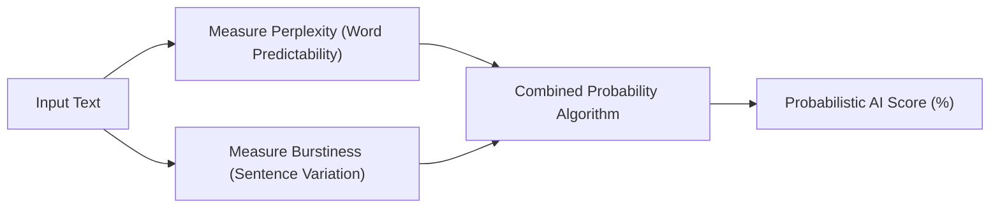

## **The Illusion of Certainty in AI Detection**

When generative language models exploded in popularity, an entire secondary industry of "AI Content Detectors" emerged promising absolute certainty. Marketers, hiring managers, and university professors were told that by pasting a paragraph into a software scanner, a percentage score (e.g. *"94% AI Generated"*) would definitive reveal whether a human or an algorithm wrote the words.

In 2026, the scientific and academic consensus has arrived at an inescapable conclusion: **probabilistic AI text detection is fundamentally unreliable**.

Major educational institutions, including Vanderbilt and the University of Maryland, have officially decommissioned detector software after discovering that innocent students were being falsely accused of plagiarism. Similarly, search engines and enterprise publishing houses have recognized that penalizing content based on flawed detector algorithms is counterproductive.

To understand why AI detectors fail—and how content creators and educators should navigate this landscape—we must examine how these tools actually function.

---

## **The Math Behind the Screen: Perplexity and Burstiness**

AI text detectors do not possess a magical fingerprint sensor. Because large language models generate standard ASCII text identical to human typing, detectors must rely on statistical heuristics:

### **1. Perplexity (Word Predictability)**
Perplexity measures how surprised a language model is by the next word in a sequence. Because LLMs are trained to predict the most statistically probable next token, raw AI text exhibits **low perplexity**: clean, highly predictable, grammatically orthodox vocabulary choices.
* **The Failure Point**: A human writer adhering strictly to formal academic standards or standard legal contracts also writes with low perplexity, causing detectors to falsely flag authentic human documents.

### **2. Burstiness (Sentence Rhythm & Variation)**
Human writers naturally vary their sentence structure. We write a short, emphatic sentence. Then we follow it with a sprawling, multi-clause observation that weaves across multiple dependent thoughts. AI models, by contrast, tend to produce uniform, medium-length sentences with balanced cadence (low burstiness).
* **The Failure Point**: Simply inserting intentional short sentences or stylistic fragments immediately fools burstiness calculations.

---

## **The Human Cost of False Positives: The ESL Penalty**

The most damaging flaw in AI detection software is its documented bias against non-native English speakers. A peer-reviewed study by Stanford University researchers tested popular AI detectors against TOEFL essays written by international students:
* Over **61% of authentic human essays written by non-native speakers were falsely flagged as AI-generated**.
* Why? Non-native writers naturally rely on simpler vocabulary, standard syntactic formulas, and limited idioms—the exact statistical signature that detectors mistake for machine output.

---

## **Google's Official Stance on AI Content and SEO**

Content marketers often live in fear that utilizing AI will cause a manual penalty in Google Search Console.

Google Search Advocate John Mueller and Google's official Search Central documentation have repeatedly clarified the search engine's philosophy:
1. **Quality Over Provenance**: Google's Helpful Content System evaluates whether an article answers user intent, demonstrates first-hand experience, and provides unique value. Google does not penalize content simply because AI tools were involved in research, outlining, or drafting.
2. **Spam Is Still Spam**: Mass-producing thousands of low-effort, regurgitated articles with zero human oversight or editing violates Google's automated spam policies—whether generated by an LLM or written by low-cost content farms.

---

## **The Future: From Guesswork to Cryptographic Provenance (C2PA)**

Because analyzing text strings after the fact is mathematically flawed, the industry is transitioning toward **cryptographic content provenance**.

The Coalition for Content Provenance and Authenticity (C2PA)—backed by Adobe, Microsoft, Google, and Intel—embeds secure, tamper-evident cryptographic metadata at the moment of creation:
* When a camera snaps a photo or an author drafts a document in an authenticated editor, cryptographic signatures record the origin tool, timestamp, and edit history.
* This shifts digital integrity from *"let's guess if a machine wrote this"* to *"here is the mathematically verifiable audit trail of how this piece was assembled."*

---

## **Conclusion: Focus on Value, Not Detection Scores**

Obsessing over whether a piece of content registers 10% or 40% on a commercial AI detector is a waste of creative energy. Detectors can be tricked by swapping a few adjectives, while genuinely helpful, well-researched human writing can be falsely flagged.

The winning strategy in 2026 is simple: **use AI transparently as a collaborative research accelerator, edit every sentence with human domain expertise, and infuse your unique lived experience into every paragraph**. True originality and human value cannot be synthesized—or faked.
