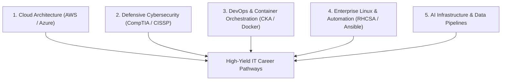

## **The Modern IT Landscape: From Hardware Maintenance to Cloud Orchestration**

The Information Technology (IT) sector has permanently transformed. In past decades, an IT career began with physical hardware troubleshooting: assembling desktop motherboards, crimping Ethernet cables, and setting up on-premise file servers.

In 2026, and accelerating rapidly toward 2027, the enterprise IT infrastructure has migrated to distributed hyperscale clouds, automated CI/CD pipelines, and software-defined networks. Routine help-desk ticket resolution is increasingly assisted by automated diagnostic bots, which means **the modern IT professional must operate at a higher level of architectural and security sophistication**.

Whether you are breaking into the technology sector for the first time or an experienced systems administrator upgrading your credentials, selecting the right training program is critical to maximizing your earning potential.

---

## **The Top 5 High-ROI IT Course Pathways for 2026 and Upcoming 2027**

---

### **1. Cloud Computing & Infrastructure (AWS & Azure)**
Cloud platforms represent the digital backbone of modern commerce. Organizations need professionals who understand how to design scalable, cost-efficient, and resilient multi-region architectures.
* **Top Foundational Course**: **AWS Certified Solutions Architect – Associate** or **Microsoft Certified: Azure Fundamentals (AZ-900 / AZ-104)**.
* **What You Learn**: Virtual private clouds (VPCs), object storage tiers, serverless compute (Lambda), auto-scaling groups, and disaster recovery strategies.
* **Target Salary Range (US)**: $110,000 – $155,000.

---

### **2. Defensive Cybersecurity & Zero-Trust Governance**
With ransomware attacks and state-sponsored cyber incursions escalating, cybersecurity specialists enjoy near-zero unemployment rates.
* **Top Foundational Course**: **CompTIA Security+ (SY0-701)**.
* **Top Advanced Course**: **Certified Information Systems Security Professional (CISSP)** or **Certified Ethical Hacker (CEH)**.
* **What You Learn**: Threat modeling, identity federation, cryptographic protocols, incident response, and zero-trust perimeter enforcement.
* **Target Salary Range (US)**: $105,000 – $165,000.

---

### **3. DevOps Engineering & Container Orchestration**
DevOps bridges the gap between software developers and operational IT teams. Heading into 2027, containerization with Kubernetes is the universal standard for enterprise microservices.
* **Top Industry Course**: **Certified Kubernetes Administrator (CKA)** (The Linux Foundation) paired with **Docker Certified Associate**.
* **What You Learn**: Infrastructure as Code (Terraform), declarative deployment manifests, automated cluster healing, and continuous deployment pipelines.
* **Target Salary Range (US)**: $125,000 – $175,000.

---

### **4. Enterprise Linux System Administration**
While consumer operating systems dominate laptops, over 90% of cloud servers and supercomputers run on Linux.
* **Top Industry Course**: **Red Hat Certified System Administrator (RHCSA)**.
* **What You Learn**: Bash shell scripting, storage volume management (LVM), security access control lists (SELinux), and automated system hardening.
* **Target Salary Range (US)**: $95,000 – $140,000.

---

### **5. AI Infrastructure Operations (AIOps)**
The newest and fastest-growing IT discipline heading toward 2027 is AIOps: configuring and managing the massive GPU clusters, high-bandwidth interconnects (InfiniBand), and vector database pipelines required to run frontier machine learning models.
* **Top Recommended Course**: **NVIDIA Certified Associate: AI Infrastructure** and **Databricks Certified Data Engineer**.
* **What You Learn**: GPU cluster resource scheduling, inference latency optimization, and distributed training pipeline reliability.

---

## **Comprehensive Course Comparison Matrix**

| Certification Track | Recommended Provider | Exam Difficulty | Average Study Time | Primary Industry Relevance |
| :--- | :--- | :---: | :---: | :--- |
| **AWS Solutions Architect** | Amazon Web Services | Medium | 8 - 12 Weeks | Enterprise Cloud, SaaS, FinTech |
| **CompTIA Security+** | CompTIA | Medium | 6 - 10 Weeks | Defense, Healthcare, Corporate Security |
| **Kubernetes (CKA)** | Linux Foundation | High (Practical) | 12 - 16 Weeks | Cloud Native DevOps, Big Tech |
| **Red Hat (RHCSA)** | Red Hat Enterprise | High (Hands-on) | 10 - 14 Weeks | Enterprise Banking, Government, Telecom |
| **Azure Administrator** | Microsoft Learn | Medium | 8 - 12 Weeks | Fortune 500, Hybrid Enterprise Environments |

---

## **How to Study and Guarantee Certification Success**

To pass rigorous technical certification exams on your first attempt:

1. **Build a Hands-On Homelab**: Theory without command-line execution is worthless. Spin up free-tier AWS accounts, deploy virtual machines in VirtualBox, and intentionally break configurations to practice troubleshooting under pressure.
2. **Use Practice Exam Simulators**: Invest in high-fidelity exam simulators (such as TutorialDojo or Boson) that explain *why* incorrect answer options are wrong.
3. **Document Your Architecture**: Create public architectural diagrams and configuration scripts on GitHub to prove your operational competency to prospective employers.

By systematically mastering cloud, security, and automation fundamentals, you establish an unshakeable career foundation ready to thrive through 2026, 2027, and beyond.
