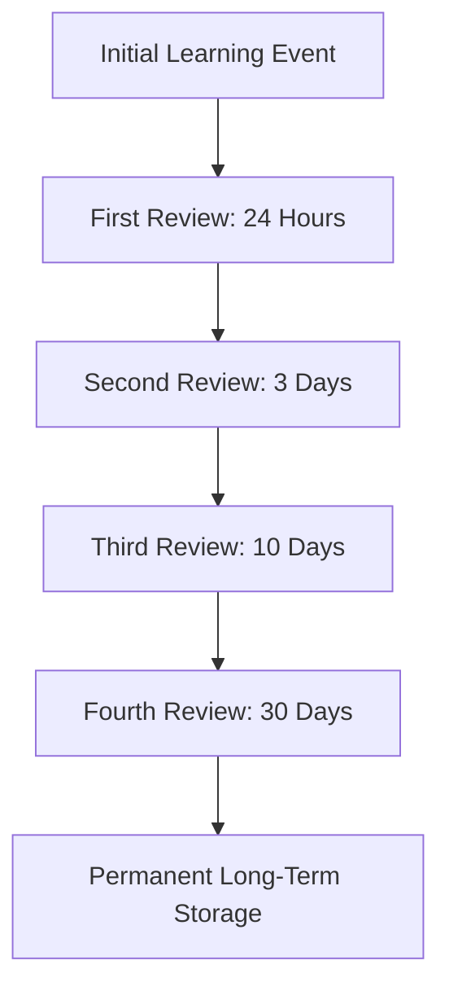

## **The Cognitive Dilemma of Vocabulary Acquisition**

Whether learning a new foreign language, mastering medical terminology, or absorbing hundreds of compliance acronyms in an enterprise workplace, human memory is fundamentally ephemeral. German psychologist Hermann Ebbinghaus proved over a century ago that without reinforcement, learners lose up to 70% of newly acquired vocabulary within 24 to 48 hours.

Traditional study techniques—such as highlighting textbook glossaries, re-reading definitions, and writing word lists—rely on **passive recognition**. When a learner looks at a word and its definition simultaneously, the brain creates an illusion of competence. In contrast, **active recall** combined with an algorithmic **Spaced Repetition System (SRS)** forces the brain to retrieve meaning from deep memory stores, forging durable neural pathways.

---

## **The Science Behind Digital Spaced Repetition (SRS)**

Digital flashcards are not mere electronic versions of paper index cards. They are precision cognitive timing engines governed by memory decay algorithms:

### **1. The Testing Effect (Retrieval Practice)**
Every time a learner views a prompt and mentally generates the target word before flipping the digital card, synaptic connections strengthen. Retrieval is not a measurement of learning; it is the act of learning itself.

### **2. Desirable Difficulty & Optimal Decay Timing**
Reviewing a card when it is fresh in memory yields minimal cognitive benefit. Reviewing it after it has been completely forgotten requires re-learning from scratch. Modern digital algorithms (such as the SuperMemo SM-2 and modern Free Spaced Repetition Scheduler / FSRS) schedule reviews at the optimal threshold of difficulty—right when the memory trace is beginning to fade.

---

## **Top Digital Flashcard Platforms Compared (2026)**

### **1. Anki: The Gold Standard for Power Learners**
Anki is an open-source, highly customizable cross-platform flashcard powerhouse beloved by medical students, polyglots, and software engineers.
* **Key Strength**: Open-source flexibility, advanced FSRS algorithmic support, and thousands of community plugins.
* **Best For**: Serious learners preparing for multi-year retention milestones (MCAT, USMLE, HSK, JLPT).

### **2. Brainscape: Best for Confidence-Based Repetition**
Brainscape uses a proprietary Confidence-Based Repetition (CBR) system where learners rate their mastery from 1 to 5 on every card flip.
* **Key Strength**: Intuitive mobile interface with zero configuration required.
* **Best For**: High school and college students seeking a structured middle ground between Quizlet and Anki.

### **3. Quizlet: Best for Collaborative Classroom Learning**
Quizlet remains the world's most accessible flashcard platform, offering interactive match games, practice tests, and AI-generated study guides.
* **Key Strength**: Instant access to millions of pre-made user decks and interactive group study modes.
* **Best For**: Collaborative study groups, rapid exam preparation, and younger learners.

---

## **The 4 Cardinal Rules of High-Yield Flashcard Deck Design**

Creating effective digital flashcards requires adherence to proven instructional design principles:

### **Rule 1: The Minimum Information Principle**
Never place multiple definitions or complex grammatical charts on a single card. Each card must test exactly one atomic fact. If a word has three distinct meanings, create three separate cards.

### **Rule 2: Provide Rich Context Sentences**
Memorizing words in total isolation leads to awkward real-world application. Always include an example sentence that demonstrates real contextual syntax and emotional tone:
* **Front**: What does *ubiquitous* mean in a workplace technology context?
* **Back**: *Existing or being everywhere at the same time.* Example: "Cloud computing and smartphones have become ubiquitous in enterprise environments."

### **Rule 3: Integrate Multi-Modal Media (Audio & Visuals)**
Dual-coding theory demonstrates that combining linguistic prompts with relevant visual imagery and native-speaker audio pronunciation doubles retrieval speed and retention longevity.

### **Rule 4: Cloze Deletion (Fill-in-the-Blank)**
Cloze deletion cards test recognition and sentence structure simultaneously:
* **Front**: "The instructional designer used spaced repetition to mitigate the effects of the `[...]` forgetting curve."
* **Back**: `Ebbinghaus`

---

## **Daily Study Protocol for Maximum Retention**

To sustain momentum without succumbing to deck review backlogs:
1. **Cap New Cards**: Limit new cards to 15 per day.
2. **Clear Daily Dues First**: Always complete review cards before introducing new cards.
3. **Be Honest with Ratings**: Never mark a card as "Easy" if you hesitated for more than 5 seconds. Accurate feedback ensures the algorithm schedules cards correctly.

By adopting digital flashcards built on genuine cognitive science, learners convert fleeting study sessions into permanent semantic fluency.
