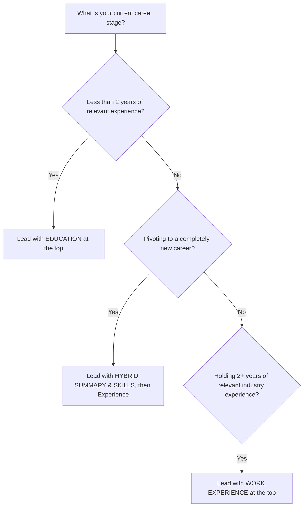

## **The 7-Second Resume Reality**

In today's corporate recruiting landscape, hiring managers and corporate recruiters review hundreds of applicants for a single open requisition. Eye-tracking research conducted by career platforms reveals that recruiters spend an average of **6 to 7.4 seconds** conducting an initial resume triage before deciding whether to advance a candidate to a phone screen.

During this brief window, recruiters scan in an **F-shaped visual pattern**: starting across the top header, reading the headline and opening summary, then scanning down the left-hand margin to inspect bold section headers and dates.

If your strongest, most persuasive qualifications are buried beneath outdated college coursework, you risk immediate disqualification. The question of whether **Education or Experience** appears first is not a matter of personal aesthetic preference; it is a strategic decision that determines whether your core value proposition registers in the first three seconds.

---

## **The Decision Matrix: Which Belongs First?**

Use the following framework to determine your optimal resume hierarchy:



---

## **Scenario Breakdown: When to Put Education First**

### **1. Current College Students and Recent Graduates (0–2 Years)**
If you graduated within the last 12 to 24 months and your work history consists primarily of part-time retail, campus work-study, or summer hospitality roles unrelated to your target career, **Education belongs at the top**.
* **What to Emphasize**: Degree title, major, graduation year (or anticipated date), academic honors (cum laude, Dean's List), relevant coursework, capstone projects, and student leadership roles.
* **When to Omit GPA**: If your GPA is below 3.5, omit it entirely. Focus instead on capstone projects and technical proficiencies.

### **2. Academic, Medical, and Research CVs**
For tenure-track faculty positions, clinical physicians, research scientists, and post-doctoral fellowships, traditional CV conventions dictate that academic credentials, fellowships, and doctoral dissertations lead the document, followed by peer-reviewed publications and grants.

---

## **Scenario Breakdown: When to Put Experience First**

### **1. Professionals with 2+ Years of Relevant Industry Experience**
Once you have accumulated two or more years of full-time, direct experience in your field, **Work Experience must always take precedence over Education**.
* Employers prioritize what you have accomplished recently in the workforce over where you sat in a lecture hall five years ago.
* Place your Education section at the bottom of the document, condensing it to your degree title, university name, and graduation year.

### **2. Mid-Career and Senior Executives**
For directors, VP-level leaders, and C-suite executives, the top half of page one must be dominated by measurable business outcomes: revenue growth, cost reductions, team scaling, and operational transformations. Your undergraduate or graduate degree is merely a validation checkpoint confirming your educational background.

---

## **How to Structure Each Scenario (Visual Formatting Examples)**

### **Format A: Recent Graduate (Education First)**

```text
ALEX CHEN
New York, NY | alex.chen@email.com | linkedin.com/in/alexchen

EDUCATION
Bachelor of Science in Computer Science | Minor in Data Analytics
State University of New York (SUNY) — May 2025
• Honors: Dean's List (All Semesters), Cum Laude (GPA: 3.82)
• Relevant Coursework: Data Structures, Machine Learning Algorithms, Database Systems
• Capstone Project: Built an automated Python predictive analytics pipeline for local non-profit

PROFESSIONAL EXPERIENCE & INTERNSHIPS
Junior Software Engineering Intern | TechVentures Inc. (Summer 2024)
• Developed responsive React UI components integrated with RESTful APIs...
```

---

### **Format B: Experienced Professional (Experience First)**

```text
JORDAN PATEL
Austin, TX | jordan.patel@email.com | linkedin.com/in/jordanpatel

PROFESSIONAL SUMMARY
Senior Instructional Designer with 7+ years of enterprise experience building scalable LMS curricula...

PROFESSIONAL EXPERIENCE
Senior Instructional Systems Designer | Global EdTech Solutions (2022 - Present)
• Architected 24 interactive SCORM-compliant onboarding modules reducing time-to-productivity by 35%...
• Managed cross-functional agile design sprints across 6 global product teams...

Instructional Designer | Core Learning Systems (2018 - 2022)
• Authored engaging microlearning assets for 15,000+ enterprise learners...

EDUCATION & CERTIFICATIONS
Certified ScrumMaster (CSM) — Scrum Alliance (2023)
Bachelor of Arts in Educational Technology — University of Texas at Austin (2018)
```

---

## **How Applicant Tracking Systems (ATS) Parse Section Headers**

Modern Applicant Tracking Systems (such as Workday, Greenhouse, Taleo, and Lever) scan resumes chronologically and categorize data using semantic section headers.

To ensure your resume parses accurately without data scrambling:
1. **Use Standard Section Headers**: Stick to recognizable phrases like `Work Experience`, `Professional Experience`, `Education`, and `Certifications`. Avoid creative headers like "Where I've Been" or "Academic Journey".
2. **Include Dates Consistently**: Format dates in standard Month Year formats (e.g., `June 2022 – Present`).
3. **Keep Degree Hierarchy Logical**: List the degree name before the university name (e.g., *Master of Business Administration (MBA), Harvard Business School*).

By aligning your resume structure with your current career trajectory, you guarantee that recruiters immediately encounter your strongest competitive advantages within the critical first seven seconds of review.
