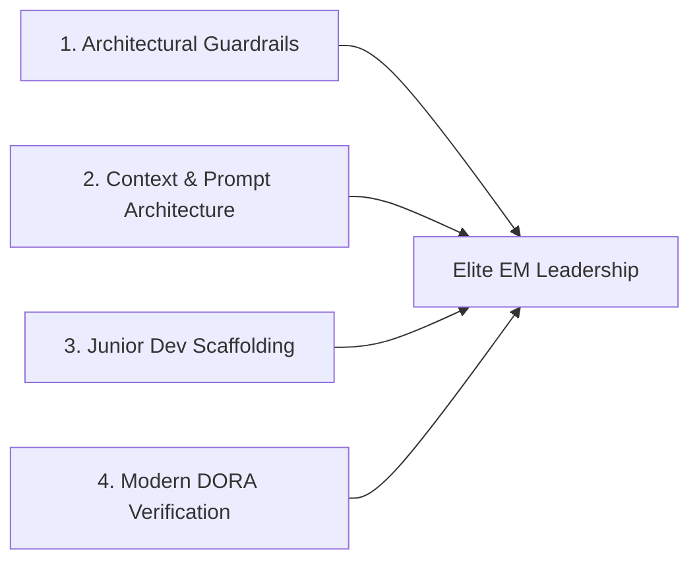

## **The Software Engineering Paradigm Shift**

For decades, the standard playbook for software engineering leadership was predictable: hire talented developers, assign user stories via agile sprints, conduct peer code reviews on pull requests, and measure team velocity through sprint burndown charts and commit frequency.

The rapid adoption of AI coding assistants—from GitHub Copilot and Cursor to autonomous agentic development tools—has permanently rewritten that playbook. Today, generating 200 lines of functional boilerplate code takes a developer ten seconds rather than four hours.

However, faster code generation does not automatically equate to superior software. In fact, engineering organizations that embrace AI coding tools without mature leadership governance frequently experience **exploding pull request backlogs, opaque architectural debt, and subtle security vulnerabilities**.

For Engineering Managers (EMs), success in 2026 is no longer defined by how quickly your team writes code; it is defined by **how intelligently your team designs, verifies, and maintains complex distributed systems in an AI-accelerated environment**.

---

## **The 5 Future Skills Every Engineering Manager Must Master**

### **1. Rigorous Architectural Guardrails Over Syntax Checking**
When developers write every line by hand, they are forced to consider data models and module boundaries during the typing process. With AI autocompletion, developers can rapidly assemble disjointed microservices that appear functional in isolation but violate overarching architectural principles.
* **The New EM Competency**: Enforcing clear Domain-Driven Design (DDD) boundaries, ensuring consistent API contracts, and training senior engineers to review pull requests for system-level coherence rather than trivial linting errors.

### **2. Prompt & Context Engineering for Developer Environments**
A software team's productivity now depends heavily on the quality of context provided to developer agents. If your team's internal documentation is fragmented, outdated, or undocumented, AI assistants produce hallucinated, non-idiomatic code.
* **The New EM Competency**: Treating repository documentation, `README.md` files, and architecture decision records (ADRs) as first-class developer tooling that powers AI context windows.

### **3. Mentoring Junior Developers in the AI Era**
The most acute cultural challenge facing engineering leaders is junior talent development. If a junior engineer uses AI to solve every bug, they bypass the painful but essential process of reading stack traces, memory profiling, and building deep cognitive debugging intuition.
* **The New EM Competency**: Structuring "No-Copilot" fundamentals workshops where junior engineers must build low-level algorithms from scratch, paired with mandatory oral code walkthroughs where engineers explain the mechanical trade-offs of their AI-suggested code.

### **4. Modernizing DORA Metrics and Team Performance**
Traditional DORA metrics (Deployment Frequency, Lead Time for Changes, Change Failure Rate, Time to Restore Service) remain foundational, but their interpretation must evolve:
* **The Warning Sign**: A massive spike in Deployment Frequency accompanied by a rising Change Failure Rate indicates that team velocity is outpacing test coverage.
* **The Fix**: Mandating that every AI-generated feature includes automated unit, integration, and fuzz tests matching the exact complexity of the generated feature.

### **5. Supply Chain Security and Intellectual Property Protection**
AI models occasionally suggest outdated, deprecated, or non-existent npm/PyPI packages—a vector known as **package hallucination typosquatting**.
* **The New EM Competency**: Implementing automated dependency scanning (e.g. Snyk, Dependabot) and enterprise license verification to ensure no proprietary company code leaks into public training pipelines and no viral copyleft licenses contaminate internal repositories.

---

## **Evaluating Engineering Productivity: Old vs New Metrics**

| Traditional Metric | Why It Fails in the AI Era | Modern AI-Era Replacement Metric |
| :--- | :--- | :--- |
| **Lines of Code (LOC)** | AI makes generating infinite code trivial | **Code Conciseness & Net Deleted Lines** (Rewarding refactoring) |
| **Pull Request Velocity** | Leads to bloated, unreviewed mega-PRs | **Review Depth & Time-to-Production** |
| **Story Points Completed** | AI automates routine story implementation | **Business Impact & Bug Escape Rate** |
| **Hours Worked** | Punishes efficient AI-native developers | **System Reliability & Uptime SLA Compliance** |

---

## **Conclusion: From Code Reviewer to Strategic Orchestrator**

The rise of AI in software development does not diminish the need for human engineering leadership; it dramatically amplifies it. Algorithms excel at localized syntax execution, but they lack long-term business context, organizational empathy, and ethical foresight.

Engineering Managers who cultivate deep architectural discipline, protect their team's intellectual growth, and maintain uncompromising quality standards will lead the most resilient, high-impact technology organizations of the next decade.
