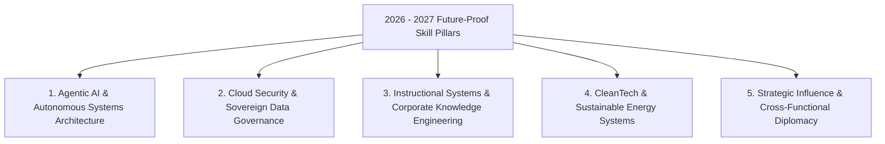

## **The New Rules of Career Resilience**

The global workforce is undergoing a profound structural re-alignment. In past decades, earning a college degree and performing reliable, diligent work guaranteed steady career advancement.

In 2026, and accelerating toward 2027, the velocity of technological disruption means that **resting on legacy credentials is a recipe for career stagnation**. According to global workforce economic forecasts, over 44% of core worker skills are expected to shift every three to four years.

However, technological disruption does not eliminate opportunity; it redistributes it. Professionals who proactively identify emerging market bottlenecks and invest in **high-yield, future-proof courses** position themselves to command premium compensation, rapid promotions, and unprecedented career autonomy.

Here are the top 5 in-demand skill domains and recommended certification courses to master in 2026 and upcoming 2027.

---

## **The Top 5 Future-Proof Skills & Courses for 2026–2027**

---

### **1. Autonomous AI & Agentic Systems Engineering**
* **Why It Is Future-Proof**: In 2024, the world learned how to prompt chatbots. By 2027, global enterprises will be entirely run on autonomous multi-agent software swarms. Organizations urgently need engineers who know how to connect LLMs to production databases, configure agentic decision loops, and implement fail-safe verification checkpoints.
* **Top Recommended Course**: **DeepLearning.AI: Multi-Agent Systems with CrewAI & LangGraph** (Coursera)
* **What You Master**: Building autonomous collaborative agent teams, tool-calling APIs, and production memory architectures.

---

### **2. Cloud Cybersecurity & Sovereign Data Governance**
* **Why It Is Future-Proof**: As AI workloads expand, data breaches and algorithmic vulnerabilities multiply exponentially. Furthermore, strict regional regulations (such as the EU AI Act and state data privacy statutes) mean companies face multi-million-dollar fines if customer data is compromised.
* **Top Recommended Course**: **Google Cloud Professional Cloud Security Engineer & AWS Certified Security Specialty**
* **What You Master**: Identity federation (IAM), zero-trust network architectures, cryptographic encryption at rest, and automated vulnerability scanning.

---

### **3. Instructional Systems Design & Corporate Knowledge Architecture**
* **Why It Is Future-Proof**: As companies automate legacy operations, workforce retraining becomes their #1 existential bottleneck. Companies cannot deploy new AI tools if their human workforce does not know how to use them. Instructional designers who know how to transform complex technical documentation into engaging microlearning modules are in historic demand.
* **Top Recommended Course**: **University of Illinois: Instructional Design MasterTrack Certificate** (Coursera)
* **What You Master**: ADDIE/SAM agile instructional frameworks, cognitive load theory, SCORM/xAPI data standards, and interactive module authoring.

---

### **4. CleanTech, Sustainable Energy & Smart Grid Systems**
* **Why It Is Future-Proof**: The explosion of AI data centers requires unprecedented electrical power, accelerating the global transition toward smart grids, battery storage, and renewable microgrids through 2027.
* **Top Recommended Course**: **MITx: Sustainable Energy Technologies & Smart Grid Systems** (edX)
* **What You Master**: Photovoltaic engineering, grid-scale storage economics, carbon accounting, and regulatory compliance.

---

### **5. High-Stakes Negotiation & Cross-Functional Diplomacy**
* **Why It Is Future-Proof**: Code can be generated, spreadsheets can be automated, and contracts can be summarized by algorithms. But when two enterprise executive teams sit in a boardroom to negotiate a $20 million acquisition or resolve a contentious union dispute, **human emotional intelligence and strategic persuasion reign supreme**.
* **Top Recommended Course**: **Harvard Online: Negotiation Mastery**
* **What You Master**: The BATNA framework, value-creation vs value-claiming dynamics, psychological anchor setting, and cross-cultural deal diplomacy.

---

## **Comparative Matrix: Return on Investment (ROI) Across Disciplines**

| Skill Domain | Time to Complete | Target Industry | 2026-2027 Salary Potential | Barrier to Entry |
| :--- | :---: | :--- | :---: | :---: |
| **Agentic AI Architecture** | 3 - 6 Months | Software, FinTech, Big Tech | $140,000 - $220,000 | Medium - High |
| **Cloud Cybersecurity** | 4 - 6 Months | Healthcare, Defense, Enterprise | $125,000 - $190,000 | Medium |
| **Instructional Design** | 3 - 5 Months | Corporate L&D, SaaS, EdTech | $85,000 - $135,000 | Low - Medium |
| **CleanTech Grid Systems** | 4 - 8 Months | Energy, Utilities, Engineering | $110,000 - $175,000 | Medium - High |
| **Executive Negotiation** | 2 - 3 Months | Management, Sales, Consulting | $150,000+ (High variable) | Low |

---

## **How to Execute Your 2026–2027 Learning Sprints**

To successfully upskill without experiencing burnout:

1. **Commit to 90-Day Sprints**: Do not attempt to master five disparate fields at once. Select **one primary technical domain** and commit to a 90-day certification sprint.
2. **Build in Public**: As you complete weekly course milestones, publish short technical breakdowns, architecture diagrams, or lessons learned on LinkedIn or GitHub.
3. **Seek Real-World Application**: Apply your course learnings immediately at your current job—build an internal automation, conduct a mini-security audit, or redesign a team onboarding doc.

By deliberately investing in the skills that complement automation rather than compete with it, you guarantee your professional indispensability through 2026, 2027, and the decades ahead.
