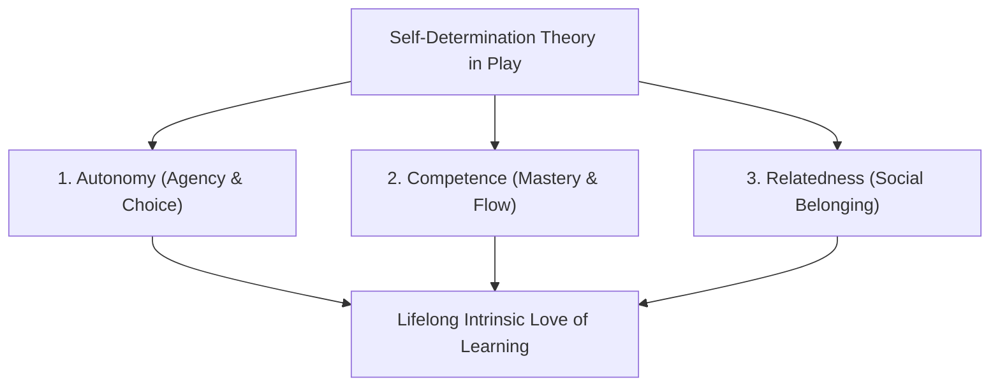

## **The Double-Edged Sword of Digital Play**

Every parent and elementary educator has witnessed the profound contrast: a child can sit completely paralyzed with boredom after ten minutes of standard textbook worksheets, yet the exact same child will spend four focused hours navigating complex spatial logic, resource management, and cooperative teamwork inside a digital game.

For the past decade, educational technology attempted to bridge this gap through **gamification**—integrating game mechanics into academic learning.

However, many early attempts stumbled into a destructive trap: **"chocolate-covered broccoli."** Developers simply slapped flashy digital badges, leaderboards, and casino-style sound effects on top of dry multiple-choice quizzes. Instead of inspiring genuine curiosity, this shallow gamification trained children to hunt for arbitrary dopamine hits while learning very little.

In 2026, progressive instructional designers and developmental psychologists are championing **Meaningful Gamification**: harnessing the emotional power of play to cultivate deep, intrinsic conceptual mastery.

---

## **The Psychological Core: Self-Determination Theory (SDT)**

Developed by psychologists Edward Deci and Richard Ryan, **Self-Determination Theory** proves that sustainable human motivation relies on three universal psychological needs:

### **1. Autonomy (Child Agency & Decision-Making)**
Children spend most of their daily lives being told what to do, when to sit, and what to eat. Games captivate them because they offer **agency**.
* **Educational Application**: Allow children to choose their learning path: *"Do you want to explore the Fraction Forest or solve the Geometry Castle first?"* Granting choice over sequence dramatically increases task commitment.

### **2. Competence (The Thrill of Mastery & Low-Stakes Failure)**
In traditional classrooms, a red 'X' on a test creates shame and anxiety. In video games, when a character falls into a pit, the child does not feel stupid; they simply hit "Retry" and adjust their strategy.
* **Educational Application**: Eliminate punitive grading in foundational modules. Offer infinite low-stakes retries with adaptive hints that celebrate diagnostic persistence.

### **3. Relatedness (Cooperative Play Over Ruthless Competition)**
High-stakes public leaderboards often demotivate 90% of a class while fueling anxiety in the top 10%.
* **Educational Application**: Replace cutthroat individual leaderboards with **collaborative classroom quests**: *"When the entire third-grade cohort solves 500 collective reading puzzles this week, our shared digital tree blossoms into a digital garden."*

---

## **The 4 Pillars of Ethical Children's Gamification Design**

### **1. Narrative-Driven Quests Over Arbitrary Points**
Children do not care about earning "50 arbitrary XP points." They care about narrative stakes:
* *Instead of*: "Complete 10 long division exercises."
* *Narrative Frame*: "The alien starship's fuel cells need to be divided equally among three rescue shuttles to escape the asteroid belt. Calculate the fuel balance to launch the fleet!"

### **2. Visual Scaffolding & Dynamic Difficulty Adjustment (DDA)**
If a math puzzle is too easy, the child experiences boredom and tabs away. If it is too difficult, working memory overloads, triggering tears and avoidance.
* **The Solution**: Modern learning games utilize real-time DDA algorithms to maintain learners in the **Goldilocks Zone of Flow**—offering just enough cognitive friction to stimulate growth without triggering cognitive shutdown.

### **3. Creative Avatars & Visual Personalization**
Allowing young learners to design their own digital avatars, unlock whimsical hats, and personalize their virtual study desk provides emotional ownership without requiring real-money microtransactions.

### **4. Natural Stopping Points (Respecting Screen Boundaries)**
Ethical educational software never uses infinite autoplay loops or coercive countdown timers that trigger family bedtime arguments.
* **Best Practice**: Structure learning journeys into discrete 15-minute "Quests" with clear celebratory end screens that explicitly encourage the child to take a physical stretch break outside.

---

## **Leading Case Studies in Children's Gamified Learning**

| Educational Platform | Core Subject Area | Primary Gamification Mechanic | Key Pedagogical Strength |
| :--- | :--- | :--- | :--- |
| **Minecraft: Education Edition** | STEM, History, Coding | Sandbox spatial construction | Limitless creative problem solving and spatial physics |
| **Prodigy Math** | K-8 Mathematics | Turn-based fantasy RPG battles | Turns repetitive math calculations into spellcasting battles |
| **Duolingo ABC** | Early Childhood Phonics | Tactile tracing, audio rhymes & mascot cheer | Zero ads, zero paywalls, sensory-rich foundational phonics |
| **Scratch (MIT Media Lab)**| Block-based programming | Interactive cartoon and game creation | Fosters computational thinking through creative play |

---

## **Conclusion: Restoring Joy to the Digital Classroom**

Play is not the enemy of serious learning; **play is nature's original, most sophisticated learning technology**.

When educators and course designers respect children's developmental psychology—replacing hollow addiction loops with genuine agency, collaborative quests, and joyful problem-solving—gamified eLearning unlocks children's natural brilliance, turning screen time into an inspiring springboard for lifelong intellectual discovery.
