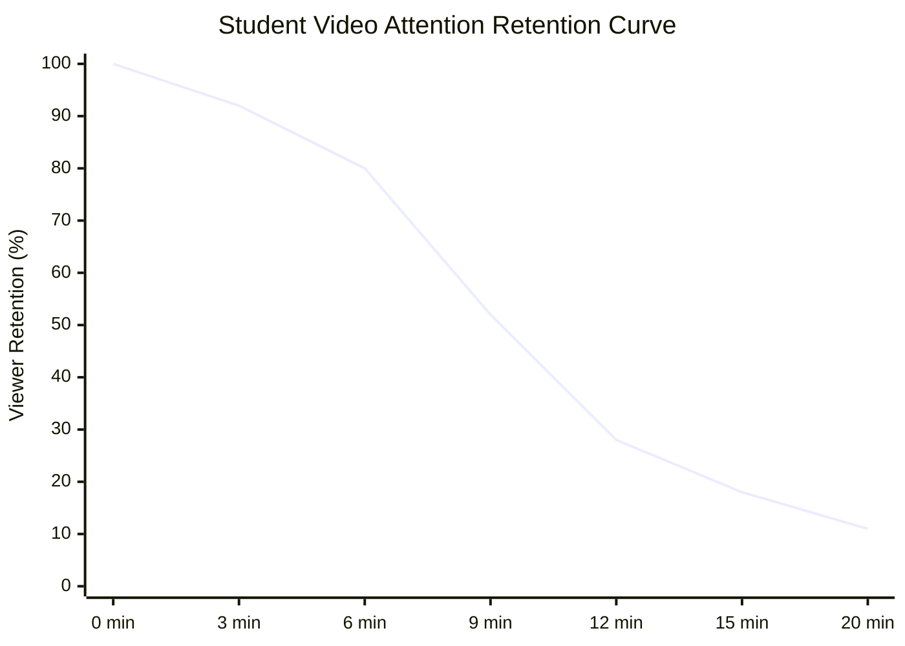

## **The Quantity vs Quality Fallacy in Course Creation**

In the early days of online education, creators operated under a simple assumption: *the longer the course, the higher the perceived value*. Instructors proudly advertised "40+ Hours of In-Depth Video Content!" as a primary selling point.

However, student behavior tells a radically different story. When busy adults encounter a 30-hour video library filled with 45-minute lectures, cognitive overwhelm triggers decision paralysis. Completion rates plummet below 10%, student refunds rise, and positive word-of-mouth evaporates.

In 2026, value is measured by **efficiency of transformation**. Your students do not want to spend their evenings watching you navigate software menus; they want to acquire the specific skill, solve their immediate bottleneck, and get back to their lives.

---

## **The Science of Engagement: The 6-Minute Drop-Off**

The definitive benchmark on digital lecture duration comes from a landmark study conducted by MIT and edX, analyzing **6.9 million video viewing sessions** across 127,000 students:

### **Core Findings:**
1. **0 to 6 Minutes**: Median engagement remains near 100%. Learners focus intensely, absorb core definitions, and follow demonstrations closely.
2. **6 to 9 Minutes**: Engagement begins to decay as cognitive load accumulates.
3. **9 to 12 Minutes**: Retention drops below 35%. Students tab away, check notifications, or abandon the lesson entirely.
4. **Beyond 15 Minutes**: Virtually no self-paced learner finishes the video in a single sitting without skimming or fast-forwarding.

---

## **The Optimal Duration Framework: Video, Module & Course**

To structure an online curriculum that sustains momentum from enrollment to graduation, align your content across these three tiers:

| Structural Unit | Target Duration | Instructional Purpose |
| :--- | :---: | :--- |
| **Individual Lesson** | **3 - 7 Minutes** | Solve 1 specific sub-problem or explain 1 discrete concept. |
| **Module / Chapter** | **25 - 45 Minutes** | Group 4 to 7 lessons together to master a cohesive competency milestone. |
| **Total Course (Standard)** | **2 - 4 Hours** | Deliver complete end-to-end transformation without cognitive exhaustion. |
| **Total Course (Mastery/Bootcamp)** | **8 - 12 Hours** | Comprehensive enterprise or professional certification roadmap. |

---

## **Recommended Course Length by Format & Business Model**

### **1. Microlearning & Soft Skills Courses (Total: 45 to 90 Minutes)**
* **Target Audience**: Corporate enterprise employees, managers, and busy executives.
* **Structure**: 12 to 15 lessons, each strictly 3 to 5 minutes.
* **Why It Works**: Can be completed over lunch or during morning commutes across one work week.

### **2. Signature Transformational Courses ($200 to $1,000)**
* **Target Audience**: Freelancers, agency owners, and professionals seeking career transitions.
* **Structure**: 4 to 6 modules, each containing 5 lessons (Total video runtime: 3 to 5 hours).
* **Companion Materials**: Interactive PDF workbooks, Notion templates, and step-by-step swipe files.

### **3. Deep Technical & Certification Bootcamps**
* **Target Audience**: Software engineers, cloud architects, and data analysts.
* **Structure**: 8 to 12 hours total, broken into 10-minute micro-lectures paired with mandatory 20-minute hands-on coding exercises.

---

## **How to Cut Fluff and Shorten Existing Courses by 40%**

If your existing course feels slow or bloated, apply these three pruning rules:

1. **Delete "Housekeeping" Small Talk**: Never open a video with: *"Hey guys, welcome back to module three, hope everyone had a great weekend..."* Jump straight into the promise: *"In this lesson, you will configure your first automated email trigger in under four minutes."*
2. **Move Background Theory to Downloadable Cheatsheets**: If an explanation requires historical context or lengthy lists of definitions, put them in a clean 2-page PDF reference guide rather than reading them aloud on video.
3. **Split Multi-Step Workflows**: If a video titled *"Setting Up Your Funnel"* runs 28 minutes, split it into four distinct 7-minute milestones:
   * Lesson 3.1: Choosing Your Funnel Template (5 mins)
   * Lesson 3.2: Connecting Your Custom Domain (6 mins)
   * Lesson 3.3: Embedding Payment Gateways (5 mins)
   * Lesson 3.4: Testing End-to-End Checkout (4 mins)

By honoring your students' time and delivering concise, high-density instruction, your completion rates will skyrocket—turning satisfied graduates into lifelong brand advocates.
