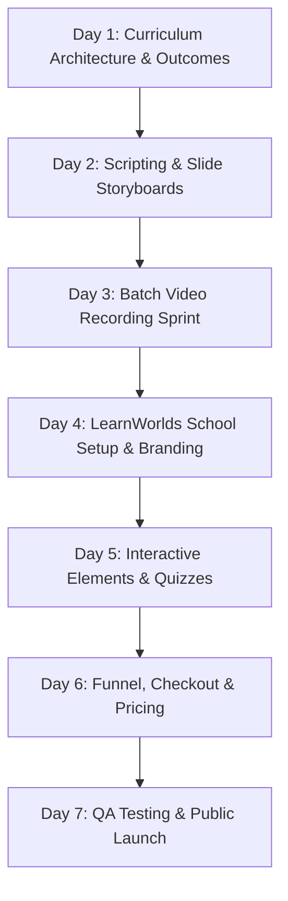

## **The Perfectionist Trap: Why Most Online Courses Never Launch**

The single greatest enemy of online course success is not competition, software bugs, or lack of knowledge—it is **perfectionist paralysis**.

Thousands of aspiring course creators spend six to twelve months agonizing over lesson scripts, buying $5,000 camera gear, and endlessly re-recording introductions. By the time they finish their 40-hour mega-course, market trends have shifted, personal enthusiasm has waned, and launch momentum has disappeared.

In 2026, the creators who dominate online education follow the **Rapid Prototyping Sprint**: launching a focused, high-density, interactive course in **seven days**.

LearnWorlds provides the ideal infrastructure for this sprint because it eliminates technical friction: website hosting, interactive video authoring, payment gateways, and community discussions are all natively unified.

Here is your exact day-by-day 7-day execution blueprint.

---

## **The 7-Day LearnWorlds Launch Schedule**

---

### **Day 1: Curriculum Architecture (Backward Design)**
Do not touch a camera or open LearnWorlds today. Focus entirely on the **Terminal Learning Objective (TLO)**:
* Define the single, measurable transformation your student will achieve upon graduation.
* Divide that transformation into **3 to 5 discrete modules**.
* Outline 4 to 6 bite-sized lessons per module, keeping each lesson focused on one sub-skill (target video length: 4 to 7 minutes).

---

### **Day 2: Scripting & Slide Storyboards**
Write concise, bulleted talking points for your 15 to 20 lessons. 
* Avoid reading verbatim scripts from a teleprompter, which makes presentations sound robotic.
* Create clean, minimalist slide decks using Canva or Google Slides: one clear headline, a relevant diagram, and maximum 3 bullet points per slide.

---

### **Day 3: Batch Video Recording Sprint**
Block out 6 uninterrupted hours for video production.
* **Audio Is 70% of Quality**: Use a high-quality USB microphone (like the Rode NT-USB Mini or Shure MV7). Clear audio with imperfect video is forgiven; beautiful 4K video with muddy audio is abandoned immediately.
* **Batch Record**: Record all module lessons in sequence while your lighting and vocal energy are consistent. If you make a mistake, pause for three seconds, clap your hands (to create an edit spike in the audio waveform), and re-state the sentence.

---

### **Day 4: LearnWorlds School Setup & Visual Branding**
Sign up for your LearnWorlds workspace and configure core institutional parameters:
* **Connect Custom Domain**: Point your DNS records (e.g. `academy.yourbrand.com`) to LearnWorlds.
* **Brand Theme**: Upload your logo, favicon, and primary brand colors (Hex codes).
* **Select a High-Converting Theme**: Choose from LearnWorlds' modern pre-designed site templates, which automatically format responsive mobile layouts.

---

### **Day 5: Authoring Interactive Elements in LearnWorlds**
Upload your processed video files to the LearnWorlds Video Library. This is where LearnWorlds outshines generic video hosting:
* **Add In-Video Interactions**: Insert a multiple-choice knowledge check at the 3-minute mark of Lesson 2.
* **Embed Title Overlays & Downloads**: Add clickable PDF resource buttons that slide out smoothly during relevant video explanations.
* **Configure Digital Certificates**: Set up automated PDF certificates that issue to students upon passing the final assessment with an 80% score.

---

### **Day 6: Pricing, Checkout Funnel & Payment Gateways**
Configure your revenue engine:
* **Connect Payment Gateways**: Link Stripe and PayPal for seamless one-click credit card, Apple Pay, and Google Pay checkouts.
* **Set Pricing Tiers**: Offer a clean single-pay option alongside an accessible 3-month payment plan.
* **Order Bumps & Upsells**: Add a high-value $37 digital workbook or 1-on-1 coaching add-on directly onto the checkout page.

---

### **Day 7: End-to-End QA Testing & Official Launch!**
Before welcoming paying students, run a complete end-to-end user audit:
1. Create a 100% off coupon code and purchase your own course using a personal email address.
2. Verify that automated welcome emails, password generation links, and invoice receipts trigger instantly.
3. Test lesson playback on both desktop Chrome and an iOS/Android smartphone.
4. **Hit Publish and Announce to Your Audience!**

---

## **Conclusion: Speed-to-Market Wins**

Your first online course does not need to be an encyclopedic opus. It needs to deliver a real, tangible result to a real human being. By executing with disciplined urgency over seven focused days, you bypass months of procrastination, validate your market demand, and launch a professional, interactive digital academy that generates sustainable recurring value.
