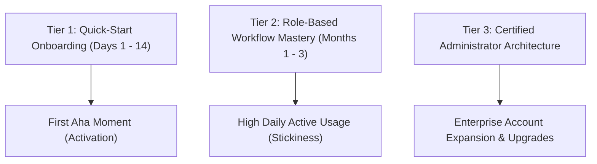

## **The Hidden Engine of B2B SaaS Retention**

In the modern enterprise software ecosystem, acquisition is only the beginning of the battle. With annual contract values rising and procurement committees scrutinizing software ROI, subscription renewals are fought and won on **daily active adoption**.

If an enterprise client signs a $50,000 annual contract, but their end-users find the software confusing or unintuitive, usage flatlines within 90 days. When renewal time arrives, the executive sponsor looks at empty utilization graphs and cancels the contract.

This is why top-tier SaaS companies—from HubSpot and Salesforce to Datadog and Figma—invest heavily in **dedicated customer training academies**. Customer education is not a peripheral marketing perk; it is the single most predictable operational lever for driving **Net Revenue Retention (NRR), deflecting support tickets, and accelerating Time-to-Value (TTV)**.

---

## **The 3-Tier SaaS Customer Training Architecture**

---

### **Tier 1: The Quick-Start Activation Sprint (Days 1 to 14)**
The objective of Tier 1 is not to teach every minor menu setting; it is to guide the user to their **First Value Milestone** in under 30 minutes.
* **Format**: Bite-sized interactive walkthroughs (under 3 minutes each) paired with in-app interactive checklists.
* **Target Outcome**: The user successfully runs their first live report, imports their first contact list, or triggers their first automated alert.

---

### **Tier 2: Role-Based Competency Tracks (Months 1 to 3)**
One of the most common mistakes SaaS companies make is forcing all users into a generic, one-size-fits-all training catalog. A daily marketing practitioner and an IT security compliance manager require fundamentally different knowledge:
* **The Practitioner Track**: Focuses on daily tactical execution, keyboard shortcuts, template libraries, and speed-of-workflow tips.
* **The Manager / Executive Track**: Focuses on reporting dashboards, team permission hierarchies, budget tracking, and strategic ROI metrics.

---

### **Tier 3: The Certified Administrator Credential**
Enterprise expansion occurs when your software becomes an indispensable line item on a client's resume.
* By offering a rigorous, proctored **"Certified Enterprise Administrator"** badge, you turn customers into enthusiastic brand champions.
* Certified users proudly display digital badges on LinkedIn, creating organic brand awareness and taking your software with them whenever they transition to new employers.

---

## **The Business Case: Key Metrics Customer Education Moves**

| Metric | Business Impact of Structured Training | Measurement Mechanism |
| :--- | :--- | :--- |
| **Time-to-Value (TTV)** | Reduced from 45 days to **under 12 days** | Milestone achievement timestamps |
| **L1 Support Ticket Volume** | Deflected by **35% to 50%** | Zendesk / Intercom deflection logs |
| **Net Revenue Retention (NRR)** | Increased by **6% to 14%** across accounts | Annual contract renewal rates |
| **Product-Qualified Leads (PQLs)** | 2.5x higher conversion to enterprise tiers | Free-tier certification completions |

---

## **5 Essential Best Practices for Designing a World-Class SaaS Academy**

1. **Keep Videos Under 4 Minutes**: Busy enterprise users do not watch 45-minute webinar replays during the workday. Chunk every topic into micro-lessons.
2. **Embed Training Inside the Product (In-App Context)**: Use tools like Pendo, WalkMe, or Whatfix to deliver contextual guidance at the exact moment a user hovers over an advanced feature.
3. **Use Real-World Sample Datasets**: Never force users to learn in an empty, sterile software shell. Provide sandbox environments populated with realistic sample data so learners can experiment without fear of breaking live production databases.
4. **Automate Milestone Celebrations**: Trigger automated congratulatory emails and Slack notifications when a user completes their first certification module.
5. **Close the Loop with Product Engineering**: Analyze drop-off rates inside your academy courses. If 70% of learners get stuck on Lesson 4 (e.g. *Configuring Webhook Integrations*), report that friction directly to your product UI/UX team to redesign the software interface.

By treating customer education as a strategic growth engine rather than an afterthought, SaaS organizations build resilient, high-retention customer relationships that compound enterprise value year over year.
