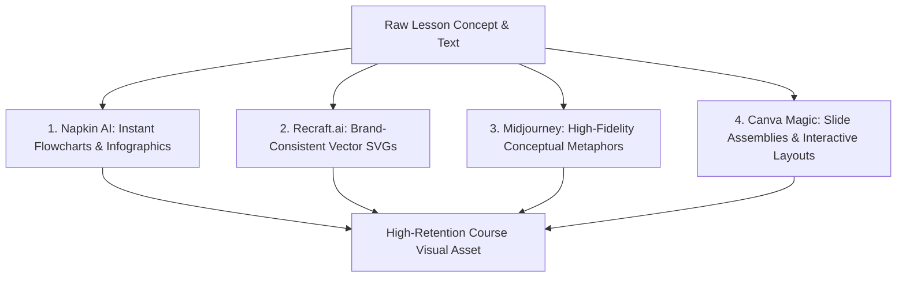

## **The End of Boring "Wall of Text" Slide Decks**

For decades, the standard visual aesthetic of digital courses was notoriously uninspired: thirty consecutive PowerPoint slides filled with bullet points, occasionally interrupted by a generic stock photo of smiling businesspeople shaking hands around a glass conference table.

In 2026, and heading into 2027, student expectations have fundamentally shifted. Modern learners, raised on high-production visual media and sleek digital applications, quickly disengage from text-heavy lectures.

More importantly, cognitive science proves that **effective visuals are not decorative; they are foundational to human learning**. According to Allan Paivio's renowned **Dual Coding Theory**, the human brain processes visual information and verbal information through separate, complementary cognitive channels. When instructional designers pair concise spoken explanation with an intuitive visual model, **knowledge retention increases by up to 400%**.

With modern generative AI visual platforms, educators no longer need a $10,000 design budget to produce studio-grade course graphics. Here is the complete playbook for creating high-impact educational visuals in 2026 and 2027.

---

## **The 4 Essential AI Visual Tools for Course Creators**

---

### **1. Napkin AI: Best for Instant Text-to-Diagram Conversion**
Napkin AI is arguably the most transformative tool for instructional writers. You paste a paragraph from your course script, and Napkin's engine automatically analyzes the logical relationships (causality, hierarchy, chronology) to generate dozens of clean, customizable visual diagrams:
* **Ideal Output**: 3-step sequence flowcharts, circular feedback loops, pros/cons comparison matrices.
* **Why Educators Love It**: Zero design expertise required; export directly to transparent PNG or SVG in under 30 seconds.

---

### **2. Recraft.ai: Best for Scalable 2D Vector Consistency**
While general art generators often produce hyper-stylized photorealism, Recraft is built specifically for digital designers and UI/UX specialists:
* **The Standout Feature**: Generates true vector files (SVG) and allows you to lock an exact corporate color palette (Hex codes) across thousands of generated icons, illustrations, and 3D clay mockups.
* **Best For**: Technical course modules, corporate compliance iconography, and consistent lesson badge milestones.

---

### **3. Midjourney (v6 / v7): Best for High-Impact Conceptual Metaphors**
Midjourney remains the undisputed champion of artistic fidelity and conceptual visual metaphors. When you need a striking module cover, a hero illustration for an LMS lesson header, or an evocative metaphorical visual, Midjourney delivers magazine-grade results:
* **Pro-Tip Prompt Formula**:
  `A clean 2D vector flat educational illustration of [Concept], corporate modern style, minimalist, muted pastel color palette, clean white background, zero clutter, high detail --no realistic photo, messy details --ar 16:9`

---

### **4. Canva Magic Studio: Best for Rapid Slide Assembly & Polish**
Canva's integrated AI suite allows educators to remove backgrounds with one click, expand cropped diagrams to fit widescreen 16:9 aspect ratios, and generate matching slide templates from raw lesson text.
* **Best For**: Rapid slide deck compilation, workbook worksheets, and branded student cheat-sheets.

---

## **The 3 Cardinal Rules of Visual Instructional Design**

Generating beautiful visuals is easy; generating pedagogically effective visuals requires deliberate restraint:

### **Rule 1: Eliminate Extraneous Decorative Clutter**
Every image in your course must directly reinforce a learning objective. If a visual does not clarify a relationship, illustrate a process, or organize information, delete it. Decorative stock photos consume cognitive bandwidth without aiding comprehension.

### **Rule 2: Maintain Visual Style Consistency**
Nothing breaks learner immersion faster than a course that uses a photorealistic image in Lesson 1, a cartoon comic in Lesson 2, and a 3D isometric render in Lesson 3. Settle on **one consistent aesthetic anchor**—such as clean flat 2D vector art—and maintain that exact visual signature across all modules.

### **Rule 3: Ensure High-Contrast Accessibility (WCAG 2.2 AA)**
Always verify that diagrams feature high color contrast between foreground text and background shapes. Avoid relying on color alone to convey meaning (e.g., using red vs green without accompanying icon shapes), ensuring complete legibility for color-blind learners.

---

## **The 2026 to 2027 Horizon: Dynamic Interactive Visuals**

Heading into 2027, the line between static course illustrations and interactive software will vanish. Next-generation educational visuals will be **dynamically responsive**:
* A medical student inspecting a cardiac cycle visual will be able to hover over ventricular valves to trigger localized AI animations and real-time hemodynamic simulations.
* An engineering student struggling with a structural beam diagram will click a toggle to have the AI re-render the concept using alternative everyday physical analogies.

By mastering AI visual generation today, you elevate your course from an ephemeral lecture into a memorable, visually captivating learning journey that students will remember for years to come.
