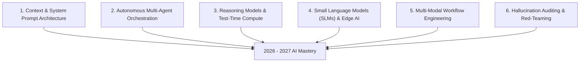

## **The 2026–2027 Paradigm Shift: From Chatbots to Autonomous Systems**

In 2023 and 2024, possessing "AI skills" simply meant knowing how to open a chat interface and generate a conversational paragraph. Early adopters gained quick advantages simply by knowing that ChatGPT existed.

In 2026, and looking ahead toward 2027, the enterprise landscape has undergone a tectonic transformation. Basic prompt generation has been commoditized across standard office software. Today, leading global organizations across technology, finance, healthcare, and education seek professionals who understand **how to architect, supervise, and verify autonomous multi-agent systems**.

Heading into 2027, we are crossing the chasm from **Copilots** (passive assistants waiting for human prompts) to **Autopilots and Agentic Teams** (proactive AI swarms operating asynchronously across databases, APIs, and business applications). 

If you want your career to remain resilient and highly compensated through 2026, 2027, and beyond, here are the essential skills and tools you must master.

---

## **The 6 Pillars of AI Competency for 2026 and Upcoming 2027**

---

### **1. Advanced Context & System Prompt Architecture**
Naive prompts produce generic, robotic answers. The defining skill of 2026–2027 is **context engineering**:
* **Few-Shot Demonstration**: Providing clear positive and negative exemplar pairs.
* **Strict Schema Outputs**: Enforcing structured JSON, YAML, or markdown tables that downstream enterprise APIs can process without parsing errors.
* **Negative Constraints & Guardrails**: Defining unambiguous boundaries that prevent scope creep and eliminate conversational fluff.

---

### **2. Autonomous Multi-Agent Orchestration**
Instead of asking a single model to research, outline, write, and proofread an entire report in one prompt, modern workflows deploy **specialized agent teams**:
* **The Researcher Agent**: Searches academic repositories and verifies source citations.
* **The Critic Agent**: Analyzes the draft for logical fallacies, unsupported assumptions, and bias.
* **The Synthesizer Agent**: Merges verified insights into an executive-ready memo.
* **Key Frameworks to Learn**: LangGraph, CrewAI, AutoGen, and no-code automation platforms like n8n and Zapier Central.

---

### **3. Steering Reasoning Models & Test-Time Compute**
The breakthrough of reasoning architectures (such as OpenAI's o1/o3 series and Claude's extended thinking protocols) represents a fundamental shift. These models spend additional compute time "thinking" before producing an output, evaluating internal trees of thought.
* **The Skill**: Learning how to give reasoning models the conceptual space to decompose multi-layered quantitative, scientific, and strategic dilemmas without prematurely restricting their reasoning pathways.

---

### **4. Small Language Models (SLMs) & On-Device Edge AI**
By 2027, not every corporate task will be routed to multi-billion-parameter cloud frontier models. Due to latency, inference costs, and data sovereignty laws (such as GDPR and the EU AI Act), enterprises are aggressively deploying high-efficiency **Small Language Models (SLMs)** like Microsoft Phi-3, Mistral NeMo, and Meta Llama 3:
* **The Skill**: Understanding when a lightweight 3B to 8B parameter model running locally on a corporate laptop or secure private server is superior to an expensive cloud API call.

---

### **5. Multi-Modal Workflow Synthesis (Audio, Video, Data)**
By 2027, text-only workflows will feel archaic. Enterprise professionals must direct multi-modal engines that bridge media effortlessly:
* Converting customer audio recordings directly into structured Jira user stories.
* Turning complex spreadsheet telemetry into narrated visual video briefings within minutes using tools like ElevenLabs, Runway, and Descript.

---

### **6. Red-Teaming, Verification & Hallucination Auditing**
As AI generation speeds increase, the value of unquestioned output plummets. The most trusted professionals in any boardroom are those with the domain expertise and critical discernment to **red-team** AI assertions:
* Catching fabricated legal precedents, statistical anomalies, or hallucinated software dependencies before they reach production environments.

---

## **The Essential AI Tool Stack: 2026 vs Upcoming 2027**

| Domain | Standard 2025/2026 Tool | Next-Generation 2026/2027 Evolution |
| :--- | :--- | :--- |
| **Frontier Reasoning** | ChatGPT-4o, Claude 3.5 Sonnet | Extended Thinking Models (o3, Claude Thinking) with test-time compute |
| **Autonomous Workflow** | Simple Zapier Webhooks | Dynamic Multi-Agent Swarms (LangGraph, n8n Agentic Nodes) |
| **Search & Discovery** | Perplexity Pro, Google Search | Real-time agentic research synthesis with verified primary data scraping |
| **Local / Edge AI** | Cloud APIs exclusively | On-device SLMs (Llama 3, Phi-3) running offline with zero data leakage |
| **Creative Assets** | Static Midjourney images | Interactive 3D generative assets and real-time synthetic video pipelines |

---

## **How to Prepare Your Career for 2027 Right Now**

To ensure your skill set remains ahead of market curves over the next 18 months:

1. **Move Beyond Single Prompts**: For every routine task, challenge yourself to build a 3-step automated pipeline where the output of one model feeds into a verification model.
2. **Learn Data Schemas (JSON/YAML)**: Familiarize yourself with basic data structuring so you can direct AI tools to communicate with modern corporate software APIs.
3. **Double Down on Your Unique Domain Expertise**: AI models have access to the same public knowledge as everyone else. Your irreplaceable value lies in your specialized industry context—the unwritten rules, cultural subtleties, and nuanced trade-offs of your field.

By embracing autonomous agentic design, reasoning architectures, and rigorous verification, you transform AI from a casual novelty into the ultimate catalyst for career acceleration through 2026 and 2027.
