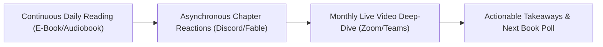

## **The Solitary Reader Dilemma**

For centuries, reading was considered an exclusively private, solitary endeavor. An individual sits quietly with a printed codex or e-reader, processes symbols on a page, and internalizes thoughts in isolation.

While solitary reading builds baseline literacy, research in educational psychology shows that **passive solitary reading often fails to cultivate high-order critical analysis**. Readers frequently skim past complex vocabulary, ignore authorial bias, and forget up to 80% of key arguments within a month of closing the back cover.

In 2026, the resurgence of **virtual book clubs** has reimagined reading as a dynamic **social learning experience**. By connecting readers across geographical boundaries via digital video rooms and asynchronous discussion feeds, online book clubs transform passive consumers into active, articulate critical thinkers.

---

## **The Cognitive Mechanics: Why Social Reading Accelerates Literacy**

### **1. The Expectation of Articulation (The Protege Effect)**
When an individual reads knowing they will be asked to summarize a chapter or defend an interpretation before a group of peers on Thursday evening, their cognitive posture fundamentally changes. They read with active focus: highlighting key passages, questioning narrative assumptions, and formulating verbal syntheses in real time.

### **2. Dialogic Reading & Cognitive De-Centering**
In a diverse virtual book club, five readers can examine the exact same paragraph and arrive at five wildly different interpretations based on their cultural, generational, and professional backgrounds. Witnessing peers uncover subtext you missed expands **cognitive empathy**—the capacity to evaluate issues from alternative cognitive vantage points.

### **3. Active Vocabulary Internalization**
Encountering an unfamiliar word in a book creates passive recognition. But when a member uses that word during a book club debate—and hears others deploy it in context—the term shifts from passive memory into active verbal vocabulary.

---

## **Synchronous vs Asynchronous Formats: Choosing Your Cadence**

Modern virtual book clubs succeed by balancing live video meetups with continuous asynchronous engagement:

| Dimension | Live Synchronous (Zoom / Teams) | Asynchronous (Discord / Fable) |
| :--- | :--- | :--- |
| **Pacing** | Fixed monthly or bi-weekly meeting | Self-paced chapter comments anytime |
| **Strengths** | Emotional connection, spontaneous debate | Accommodates global time zones & introverts |
| **Best For** | Deep analytical synthesis & relationship building | In-the-moment margin notes & quote sharing |

---

## **The 5-Step Blueprint to Facilitating an Engaging Online Book Club**

### **Step 1: Choose the Right Thematic Cadence**
Avoid overwhelming members with 600-page historical epics unless you lead a specialized literary society. The optimal cadence for working adults is **one book every 4 to 6 weeks**, targeting 200 to 300 pages.

### **Step 2: Assign Rotating Socratic Discussion Leaders**
Never allow the book club to become a lecture where the founder asks questions and members answer tentatively. Rotate the facilitation role each month. Task the leader with selecting three open-ended thematic questions:
* *Bad Question*: "What happened at the end of chapter 4?" (Factual trivia)
* *Good Question*: "Do you agree with the protagonist's decision in chapter 4, and how does that moral dilemma reflect current dilemmas in our industry?" (Evaluative synthesis)

### **Step 3: Establish Multi-Modal Channel Architecture**
On platforms like Slack or Discord, structure your channels logically:
* `#announcements-and-schedule`
* `#chapter-spoilers-free-chat`
* `#favorite-quotes-and-takeaways`
* `#off-topic-coffee-lounge`

### **Step 4: Incorporate Lightning Rounds and Visual Polls**
Open synchronous video calls with an interactive icebreaker:
* *"In one word, what was the dominant emotion of this book?"*
* *"Rate the author's central thesis from 1 to 5 on the Zoom chat."*

---

## **Corporate Applications: Building Culture Through Collective Reading**

Forward-thinking remote and hybrid enterprises are increasingly replacing generic webinars with structured quarterly reading circles:

1. **Leadership Alignment**: Engineering directors, product managers, and design leads read a shared management text (e.g. *Radical Candor* or *Thinking in Systems*) to develop shared managerial vocabulary.
2. **Diversity and Global Inclusion**: Reading international fiction or memoirs allows distributed global teams to develop deep cross-cultural understanding and empathy.
3. **Cross-Silo Relationship Building**: A junior customer support specialist and a senior VP of Marketing discuss the same book on equal footing, breaking down hierarchical silos.

By transforming reading into a shared social quest, virtual book clubs develop the most vital cognitive capacities of the 21st century: nuanced comprehension, articulate verbal expression, and compassionate perspective-taking.
