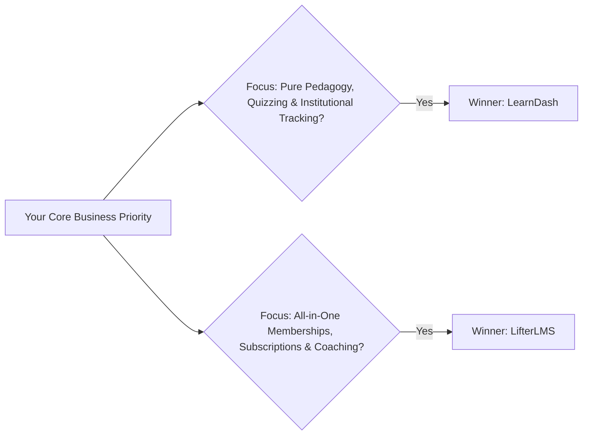

## **The Battle for WordPress E-Learning Supremacy**

If you have chosen WordPress over proprietary closed-ecosystem platforms (like Teachable, Kajabi, or Thinkific), you already understand the tremendous value of **complete data ownership, zero transaction fees, and limitless customizability**.

However, when building a self-hosted digital academy, one pivotal technical decision determines your long-term success: **Which WordPress LMS plugin should power your curriculum?**

While dozens of lightweight plugins exist, the industry has long been dominated by two heavyweight champions: **LearnDash** and **LifterLMS**.

Both plugins are mature, robust, and capable of scaling to tens of thousands of paying students. But their underlying architectural philosophies are fundamentally distinct. Here is an honest, head-to-head evaluation to help you choose the ideal engine for 2026, 2027, and beyond.

---

## **Head-to-Head Comparison: Core Feature Breakdown**

---

### **1. Course Builder & Student Experience (Winner: LearnDash)**
* **LearnDash's Distraction-Free Focus Mode**: LearnDash pioneered the dedicated "Focus Mode," which strips away WordPress sidebars, menus, and footers, immersing students in a sleek, modern visual interface identical to Coursera or MasterClass.
* **Curriculum Hierarchy**: LearnDash provides a deeply structured multi-tier hierarchy: *Courses ➔ Modules ➔ Lessons ➔ Topics ➔ Quizzes*.
* **LifterLMS Builder**: LifterLMS features a unified drag-and-drop course builder that allows you to outline sections and lessons directly from a single canvas, which is exceptionally fast for visual thinkers.

---

### **2. Quizzing, Assessments & Question Types (Winner: LearnDash)**
* **LearnDash**: Features **8 distinct question types**, including single choice, multiple choice, sorting, matching, open-ended free text, matrix sorting, and fill-in-the-blank. It supports time limits, hint reveals, question randomizers, and prerequisite exam scores.
* **LifterLMS**: Offers solid basic quizzing (multiple choice, true/false), but requires the premium *LifterLMS Advanced Quizzes* add-on for question timers and advanced question types.

---

### **3. E-Commerce, Subscriptions & Memberships (Winner: LifterLMS)**
* **LifterLMS**: Native e-commerce is where LifterLMS truly dominates. You do not need WooCommerce or external plugins to sell courses. LifterLMS includes native Access Plans, recurring subscription billing, trial periods, and private coaching upgrades right out of the box.
* **LearnDash**: While LearnDash includes basic Stripe and PayPal integrations, complex recurring memberships, coupons, and tiered bundles typically require pairing it with WooCommerce, MemberPress, or SureCart.

---

### **4. Database Performance & Speed Under Load (Winner: LearnDash)**
* **Database Architecture**: Both plugins utilize custom post types, but LearnDash stores course relationships and progression states in a streamlined custom database schema that executes fewer queries during heavy concurrent traffic.
* **High-Concurrency Testing**: When 500 students simultaneously hit the "Submit Quiz" button at the end of a live workshop, LearnDash exhibits lower database lock latency than LifterLMS when properly paired with Redis object caching.

---

## **Feature Comparison Matrix**

| Feature Dimension | LearnDash LMS | LifterLMS |
| :--- | :--- | :--- |
| **Course Hierarchy** | Course ➔ Section ➔ Lesson ➔ Topic ➔ Quiz | Course ➔ Section ➔ Lesson ➔ Quiz |
| **Distraction-Free UI** | Built-in Focus Mode | Available via themes |
| **Native Memberships** | Basic (Requires MemberPress for advanced) | **Exceptional Native Access Plans** |
| **SCORM / xAPI Support** | Excellent (via Tin Canny / GrassBlade) | Good (via external integrations) |
| **Private 1-on-1 Coaching**| Requires third-party tools | **Native Private Areas add-on** |
| **Base Pricing (Annual)** | $199 / year | Free Core + Paid Bundles ($180 - $1,200) |

---

## **The Decision Framework: Which Should You Choose?**

### **Choose LearnDash If:**
1. Your primary focus is **pedagogical rigor, academic assessment, and employee training**.
2. You need advanced SCORM, xAPI, or Tin Can tracking from tools like Articulate Storyline.
3. You already have an established WooCommerce store or external CRM managing your checkout.
4. You want predictable flat-rate annual pricing that includes virtually all core features.

### **Choose LifterLMS If:**
1. You run a **coaching business, paid membership community, or subscription academy**.
2. You want to avoid the complexity and overhead of installing WooCommerce or MemberPress.
3. You want native 1-on-1 private student workspaces to review personal homework assignments.
4. You prefer a modular plugin where you only pay for the specific add-ons you actively use.

Both plugins represent the absolute pinnacle of open-source WordPress educational technology. Select the tool that matches your business model, invest in high-performance managed hosting, and focus relentlessly on delivering transformative student outcomes.
