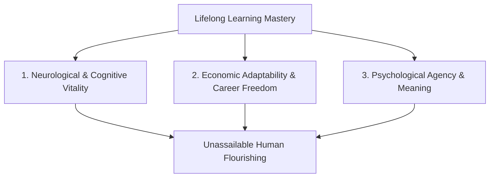

## **The Universal Human Imperative**

From the moment a child takes their first tentative steps to an experienced engineer mastering an emerging programming paradigm, learning is the fundamental defining characteristic of human consciousness. It is the bridge connecting our current capabilities with our future potential.

Yet in modern adult life, learning is frequently reduced to a transactional obligation: a compliance certificate required by human resources, or a mandatory credential needed to pass a job interview screen.

When we view learning merely as a chore, we forfeit its profound transformative power. In 2026, amid accelerating technological change, economic shifts, and longer human life expectancies, understanding **why learning is essential** is not just an academic exercise—it is the cornerstone of a meaningful, resilient, and flourishing life.

---

## **The 3 Core Dimensions of Lifelong Learning**

---

### **1. Neurological Vitality: The Science of Neuroplasticity**
For decades, classical neuroscience asserted that the adult human brain was rigid and unchangeable after adolescence. Modern brain imaging has completely disproven this myth.

The human brain possesses lifelong **neuroplasticity**—the dynamic capacity to reorganize synaptic architecture in response to novel experiences, intellectual challenges, and deliberate practice.
* **Building Cognitive Reserve**: When you learn a foreign language, master a musical instrument, or study complex quantitative concepts, you build dense alternative neural pathways. Epidemiological studies demonstrate that individuals with high cognitive reserves show remarkable resilience against memory loss and Alzheimer's disease.
* **Dopamine & Mental Agility**: Overcoming a difficult intellectual hurdle triggers dopamine release in the brain's reward centers, boosting mood, intrinsic curiosity, and creative problem-solving fluency.

---

### **2. Economic Adaptability: Your Personal Inflation Hedge**
In past generations, a college degree was considered an educational terminal point that guaranteed 40 years of stable career advancement. Today, the half-life of professional skills has fallen to under four years.
* **The Compound Interest of Knowledge**: Just like financial compound interest, small daily investments in learning compound exponentially over a career. Spending 30 minutes a day reading deep industry analysis equals over 180 hours of specialized knowledge per year—propelling you into the top 5% of your professional domain.
* **Career Insurance Against Automation**: When algorithms automate routine execution, professionals who possess multidisciplinary knowledge—combining subject-matter depth with technological literacy—become irreplaceable strategic translators.

---

### **3. Psychological Agency: From Helplessness to Self-Efficacy**
Few experiences are more demoralizing than feeling helpless in the face of rapid change. When individuals stop learning, the world feels confusing, overwhelming, and threatening.
* **The Growth Mindset**: As psychologist Carol Dweck demonstrated, adopting a growth mindset—believing that intellectual capacity expands with effort and strategy—transforms obstacles into invitations for growth.
* **Self-Actualization**: True human satisfaction does not stem from passive leisure; it stems from what psychologist Mihaly Csikszentmihalyi termed **flow**—the state of deep absorption achieved when tackling challenges that stretch our abilities to their limits.

---

## **4 Practical Habits to Build a Sustainable Lifelong Learning Engine**

You do not need to quit your job or enroll in a full-time university program to become a relentless lifelong learner:

### **1. The Rule of 5 Hours (Benjamin Franklin's Habit)**
Throughout his life, Benjamin Franklin dedicated one hour every weekday morning strictly to reading, writing, and deliberate experiments, regardless of his political or business obligations. Carve out 60 minutes five days a week for non-urgent, high-density learning.

### **2. Curate Your Information Diet Ruthlessly**
You are what you consume. Unsubscribe from sensationalist clickbait news, mute rage-inducing social feeds, and replace them with peer-reviewed journals, foundational non-fiction books, and rigorous technical newsletters.

### **3. Teach What You Learn (The Feynman Technique)**
The fastest way to identify whether you truly understand a concept is to explain it in plain, simple language to someone unfamiliar with the subject. If you must resort to complex jargon to explain an idea, you have not yet mastered the fundamentals.

### **4. Maintain a Digital "Second Brain"**
Do not rely on biological memory alone to store insights. Use personal knowledge management tools (such as Obsidian, Notion, or Apple Notes) to capture key quotes, summarize book chapters, and cross-reference ideas across disciplines.

---

## **Conclusion: The Ultimate Act of Freedom**

In the final analysis, learning is the ultimate declaration of personal sovereignty. It allows you to reinvent yourself at age 25, 45, or 75. It ensures that you are never trapped by past circumstances, economic disruptions, or outdated assumptions.

By committing to continuous, curious, lifelong learning, you ensure that your mind remains perpetually vibrant, your skills remain undeniably valuable, and your life remains an inspiring voyage of discovery.
