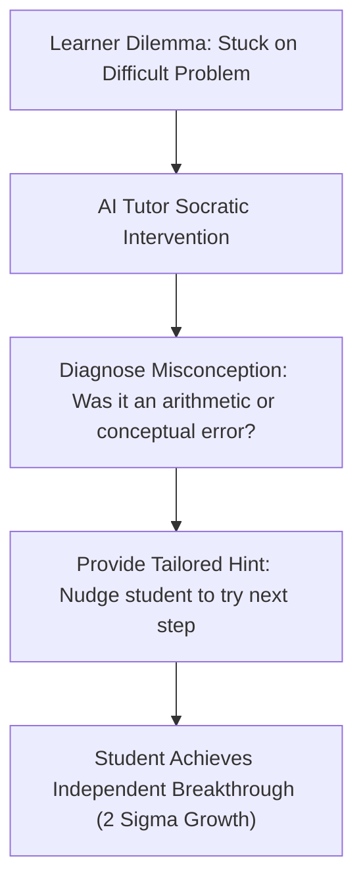

## **The Holy Grail of Education: Solving Bloom's 2 Sigma Problem**

In 1984, legendary educational psychologist Benjamin Bloom published a landmark research paper that haunted educators for four decades. Bloom demonstrated that an average student paired with a dedicated **one-on-one human tutor** performed **two standard deviations better** than students taught in standard thirty-person classrooms. A 50th-percentile student vaulted into the 98th percentile simply by receiving individualized, immediate, adaptive feedback.

For forty years, this was known as **Bloom's 2 Sigma Problem**: the world knew how to unlock genius-level performance in virtually every student, but society lacked the economic resources to hire a dedicated private tutor for every human child on earth.

In 2026, and accelerating toward 2027, Artificial Intelligence is finally solving the 2 Sigma Problem. Today's premier AI tutoring platforms are not passive search engines or automated calculators; they are **empathetic, infinite, Socratic personal tutors** that adapt to each learner's unique cognitive pace.

---

## **Top AI Tutoring Platforms Compared for 2026 and Upcoming 2027**

---

### **1. Khanmigo (by Khan Academy): The Benchmark for Socratic Mastery**
Built on OpenAI's frontier models by Sal Khan's team, Khanmigo is the gold standard for ethical classroom tutoring.
* **The Standout Feature**: Khanmigo has strict pedagogical guardrails. If a student types *"Give me the answer to 3x + 12 = 24"*, Khanmigo responds: *"I'd love to help! Let's start by looking at that +12. What mathematical operation could we use on both sides to isolate the 3x term?"*
* **Best For**: K-12 and early college students across mathematics, science, and humanities.

---

### **2. Synthesis Tutor: Best for Deep Mental Models & Creative Math**
Born out of Elon Musk's experimental Ad Astra school, Synthesis Tutor gamifies mathematics and spatial logic.
* **The Standout Feature**: Students interact with an animated Socratic avatar that guides them through multi-dimensional visual puzzles rather than standard algebraic worksheets.
* **Best For**: Elementary and middle school learners building first-principles quantitative intuition.

---

### **3. Duolingo Max: Best for Natural Language Immersion**
Duolingo Max integrates frontier conversational reasoning directly into language acquisition through two flagship features: **Roleplay** and **Explain My Answer**.
* **The Standout Feature**: Rather than just marking a conjugation incorrect, Duolingo Max analyzes the student's exact grammatical misconception and explains *why* a native speaker would use the subjunctive mood in that specific context.
* **Best For**: Global language learners preparing for real-world conversational travel and business.

---

### **4. Socratic by Google & Gemini for Education**
Google's educational AI engine combines computer vision with Google Knowledge Graph algorithms.
* **The Standout Feature**: Students photograph a complex diagram from an anatomy or chemistry textbook, and Socratic breaks down the underlying biological cycles with high-fidelity visual explainer cards.
* **Best For**: Visual learners and high school science students needing instant homework diagnostic assistance.

---

## **The 2026 vs 2027 AI Tutoring Horizon**

| Capability | 2026 Baseline | Upcoming 2027 Frontier |
| :--- | :--- | :--- |
| **Input Medium** | Text prompts and camera photos | Real-time continuous video & spoken voice |
| **Pacing Control** | Student triggers each interaction | AI detects pauses and proactively offers encouraging hints |
| **Emotional IQ** | Purely analytical text responses | Voice modulation sensing frustration, anxiety, or boredom |
| **Memory Persistence**| Session-bound conversation context | Multi-year longitudinal student memory tracking mastery curves |
| **Curriculum Scope** | Standard K-12 math and languages | Advanced specialized graduate, engineering, and medical training |

---

## **How Parents & Educators Can Harness AI Tutors Safely**

To ensure students develop genuine intellectual resilience rather than algorithmic dependency:

1. **Establish the "Explain It Back" Rule**: After working with an AI tutor, have the student explain the concept out loud to a parent or peer without looking at the screen.
2. **Prioritize Socratic Platforms**: Avoid generic chatbots that supply immediate final answers; mandate platforms like Khanmigo that enforce productive struggle.
3. **Celebrate Persistence Over Speed**: Praise learners for asking thoughtful diagnostic questions when stuck, reinforcing that asking for help is an act of intellectual courage.

By welcoming these transformative AI mentors into our homes and classrooms, we democratize elite one-on-one education, turning every curious learner into a self-directed, unstoppable scholar.
